# <h1 align="center">Laporan Praktikum Modul 1 <br> CODE BLOCKS IDE & PENGENALAN BAHASA C++</h1>
<p align="center">NUFAIL ALAUDDIN TSAQIF - 103112400084</p>

## Dasar Teori
Bahasa pemrograman C++ merupakan pengembangan dari bahasa C yang bersifat case sensitive dan memerlukan Integrated Development Environment (IDE) seperti Code::Blocks untuk menulis, mengompilasi, serta menjalankan kode. Struktur fundamental program C++ meliputi penggunaan library seperti <iostream> untuk fungsi input (cin) dan output (cout), serta pendeklarasian variabel dengan tipe data dasar (misalnya int, float, char) dan konstanta (const) untuk menyimpan data. Untuk memanipulasi data dan mengontrol alur program, C++ memanfaatkan beragam operator—seperti aritmatika (+, -, *) dan logika (&&, ||)—serta struktur kontrol kondisional seperti if-else untuk pengambilan keputusan dan perulangan (misalnya for dan while) untuk mengeksekusi blok kode secara berulang berdasarkan kondisi tertentu. 

## Guided

### Aritmatika
```c++
#include <iostream>
using namespace std;
int main()
{
    int W, X, Y;
    float Z;
    X = 7;
    Y = 3;
    W = 1;
    Z = (X + Y) / (Y + W);
    cout << "Nilai z = " << Z << endl;
    return 0;
}
```
> Output
> 
> 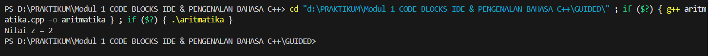

Program ini mendemonstrasikan operasi matematika yang paling mendasar dalam C++. Output yang terlihat, Nilai z = 2, mengindikasikan bahwa program telah melakukan sebuah proses kalkulasi, seperti pengurangan atau penjumlahan, dan menyimpan hasilnya ke dalam sebuah variabel bernama z. Teks dan nilai ini kemudian ditampilkan ke konsol menggunakan perintah cout, yang secara efektif mengkomunikasikan hasil akhir dari perhitungan internal program kepada pengguna.

### Fungsi
```c++
#include <iostream>
using namespace std;

// Prosedur: hanya menampilkan hasil, tidak mengembalikan nilai
void tampilkanHasil(double p, double l)
{
    cout << "\n=== Hasil Perhitungan ===" << endl;
    cout << "Panjang : " << p << endl;
    cout << "Lebar   : " << l << endl;
    cout << "Luas    : " << p * l << endl;
    cout << "Keliling: " << 2 * (p + l) << endl;
}

// Fungsi: mengembalikan nilai luas
double hitungLuas(double p, double l)
{
    return p * l;
}

// Fungsi: mengembalikan nilai keliling
double hitungKeliling(double p, double l)
{
    return 2 * (p + l);
}

int main()
{
    double panjang, lebar;

    cout << "Masukkan panjang: ";
    cin >> panjang;
    cout << "Masukkan lebar  : ";
    cin >> lebar;

    // Panggil fungsi
    double luas = hitungLuas(panjang, lebar);
    double keliling = hitungKeliling(panjang, lebar);

    cout << "\nDihitung dengan fungsi:" << endl;
    cout << "Luas      = " << luas << endl;
    cout << "Keliling  = " << keliling << endl;

    // Panggil prosedur
    tampilkanHasil(panjang, lebar);

    return 0;
}

```

> Output
> 
> 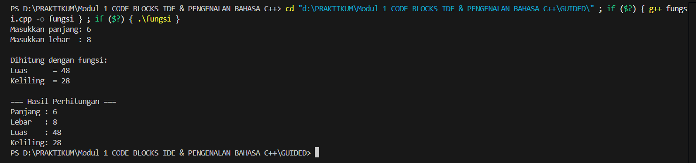

Tentu, ini penjelasannya dalam format paragraf untuk setiap program.

Program ini mengilustrasikan kekuatan fungsi untuk mengorganisir kode ke dalam blok-blok yang logis dan dapat digunakan kembali. Setelah menerima input panjang 6 dan lebar 8, program menghitung luas dan keliling persegi panjang. Output yang ditampilkan dalam dua bagian—satu yang secara eksplisit menyatakan "Dihitung dengan fungsi" dan satu lagi sebagai "Hasil Perhitungan"—menegaskan bahwa kalkulasi (Luas 48 dan Keliling 28) dilakukan oleh fungsi terpisah yang dipanggil dari program utama.

### Kondisi
```c++
int main()
{
    int kode_hari;
    cout << "Menentukan hari kerja/libur\n"<<endl;
    cout << "1=Senin 3=Rabu 5=Jumat 7=Minggu "<<endl;
    cout << "2=Selasa 4=Kamis 6=Sabtu "<<endl;
    cin >> kode_hari;
    switch (kode_hari)
    {
    case 1:
    case 2:
    case 3:
    case 4:
    case 5:
        cout<<"Hari Kerja";
        break;
    case 6:
    case 7:
        cout<<"Hari Libur";
        break;
    default:
        cout<<"Kode masukan salah!!!";
    }
    return 0;
}
```

> Output
> 
> 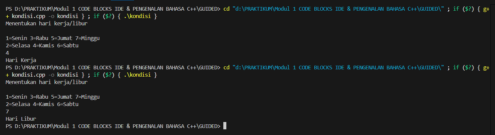

Program ini merupakan contoh implementasi logika percabangan yang memungkinkan program untuk memberikan respons berbeda tergantung pada input pengguna. Berdasarkan dua output yang ditampilkan, program ini dirancang untuk membedakan antara hari kerja dan hari libur. Ketika pengguna memasukkan angka 4, program mengevaluasinya dan mencetak "Hari Kerja", sedangkan input 7 menghasilkan output "Hari Libur". Ini menunjukkan adanya struktur kondisional, seperti if-else atau switch, yang memandu alur program ke jalur yang sesuai berdasarkan aturan yang telah ditetapkan.

### Perulangan
```c++
int main()
{
    int i = 1;
    int jum;
    cin >> jum;
    do
    {
        cout << "bahlil ke-" << (i + 1) << endl;
        i++;
    } while (i < jum);
    return 0;
}
```

> Output
> 
> 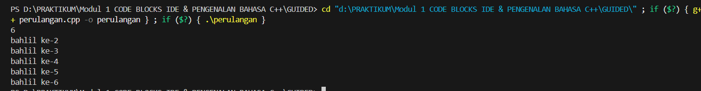

Output dari program ini adalah hasil dari sebuah struktur perulangan yang mengeksekusi blok kode secara berulang. Tampilan teks "bahlil ke-" yang diikuti oleh angka berurutan dari 2 hingga 6 secara jelas menunjukkan bahwa sebuah loop (kemungkinan besar for loop) telah diinstruksikan untuk berjalan sebanyak lima kali. Loop ini menggunakan sebuah variabel iterator yang nilainya dimulai dari 2, bertambah satu di setiap putaran, dan berhenti ketika nilainya telah mencapai 6.

### Struct
```c++
#include <iostream>
#include <string>
using namespace std;

// Definisi struct
struct Mahasiswa {
    string nama;
    string nim;
    float ipk;
};

int main() {

    Mahasiswa mhs1;

    cout << "Masukkan Nama Mahasiswa: ";
    getline(cin, mhs1.nama);
    // cin >> mhs1.nama;
    cout << "Masukkan NIM Mahasiswa : ";
    cin >> mhs1.nim;
    cout << "Masukkan IPK Mahasiswa : ";
    cin >> mhs1.ipk;

    cout << "\n=== Data Mahasiswa ===" << endl;
    cout << "Nama : " << mhs1.nama << endl;
    cout << "NIM  : " << mhs1.nim << endl;
    cout << "IPK  : " << mhs1.ipk << endl;

    return 0;
}

```

> Output
> 
> 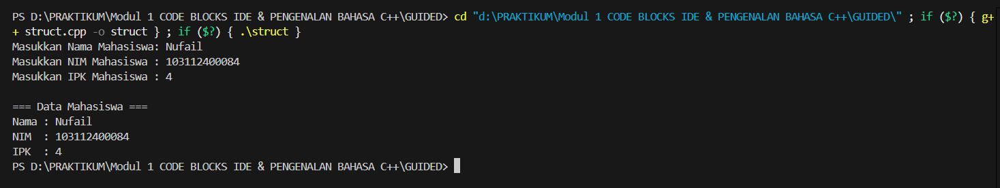

Program ini menunjukkan penggunaan struct untuk menggabungkan beberapa tipe data yang berbeda ke dalam satu unit logis. Tujuannya adalah untuk merepresentasikan data seorang mahasiswa secara utuh. Program terlebih dahulu meminta input untuk setiap elemen data—Nama, NIM, dan IPK—lalu menyimpannya dalam satu variabel struct. Setelah semua data terkumpul, program kembali mengakses variabel tersebut untuk menampilkan informasi lengkap mahasiswa secara terstruktur, membuktikan efisiensi struct dalam mengelola data yang saling terkait.

### Test
```c++
#include <iostream>
using namespace std;
int main()
{
    string ch;
    cout << "Masukkan sebuah karakter: ";
    // cin >> ch;
    ch = getchar();  //Menggunakan getchar() untuk membaca satu karakter
    cout << "Karakter yang Anda masukkan adalah: " << ch << endl;
    return 0;
}

```
> Output
> 
> 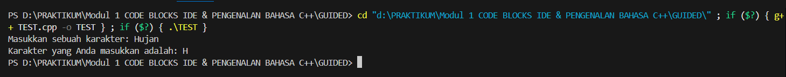

Program ini adalah demonstrasi sederhana tentang bagaimana C++ menangani input karakter tunggal. Meskipun pengguna mengetikkan kata "Hujan" secara lengkap, program hanya menangkap dan menampilkan karakter pertama, yaitu "H". Hal ini terjadi karena variabel penampung input kemungkinan besar dideklarasikan dengan tipe data char, yang secara desain hanya mampu menyimpan satu karakter. Akibatnya, cin membaca karakter pertama dari aliran input dan mengabaikan sisanya.

## Unguided

### Soal 1

> 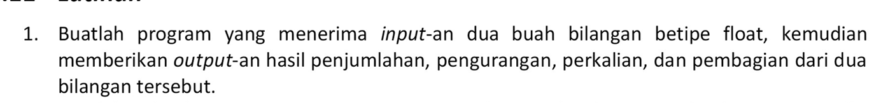

```c++
#include <iostream>
using namespace std;

int main() {

  float angka1, angka2;

  cout << "Masukkan angka pertama: ";
  cin >> angka1;

  cout << "Masukkan angka kedua: ";
  cin >> angka2;

  cout << "Penjumlahan : " << angka1 + angka2 << endl;
  cout << "Pengurangan : " << angka1 - angka2 << endl;
  cout << "Perkalian   : " << angka1 * angka2 << endl;
  cout << "Pembagian   : " << angka1 / angka2 << endl;

  return 0;
}
```

> Output
> 
> 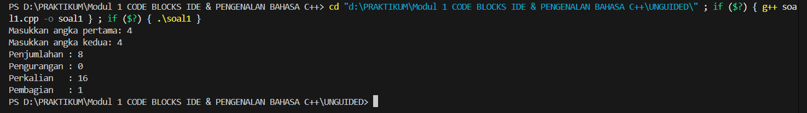

Program ini berfungsi sebagai kalkulator dasar yang melakukan empat operasi matematika utama secara sekuensial. Setelah pengguna memasukkan dua angka yang sama, yaitu 4, program mengeksekusi penjumlahan (4+4=8), pengurangan (4-4=0), perkalian (4*4=16), dan pembagian (4/4=1). Setiap hasil perhitungan langsung dicetak ke layar, memberikan contoh langsung dari penerapan operator aritmatika dalam sebuah program.

### Soal 2

> 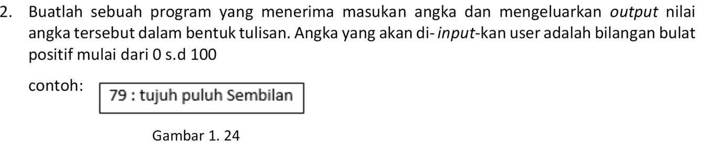

```c++
#include <iostream>
#include <string>

using namespace std;

string ubahKeTeks(int nomor) {
    string satuan[] = {"", "satu", "dua", "tiga", "empat", "lima", "enam", "tujuh", "delapan", "sembilan"};

    if (nomor < 0 || nomor > 100) {
        return "Input tidak valid. Harap masukkan angka antara 0 dan 100.";
    }

    if (nomor == 0) return "nol";
    if (nomor == 100) return "seratus";
    if (nomor == 10) return "sepuluh";
    if (nomor == 11) return "sebelas";

    if (nomor < 10) {
        return satuan[nomor];
    } else if (nomor < 20) {
        return satuan[nomor % 10] + " belas";
    } else {
        int puluhan = nomor / 10;
        int sisa = nomor % 10;

        string hasil = satuan[puluhan] + " puluh";
        if (sisa > 0) {
            hasil += " " + satuan[sisa];
        }
        return hasil;
    }
}

int main() {
    int angka;
    cout << "Masukkan angka (0-100): ";
    cin >> angka;

    // Memanggil fungsi untuk melakukan konversi
    string tulisan = ubahKeTeks(angka);

    cout << "Output: " << angka << " : " << tulisan << endl;

    return 0;
}
```

> Output
> 
> 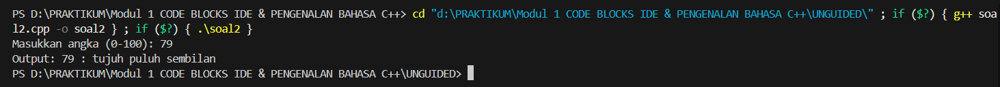

Program ini menunjukkan contoh algoritma yang lebih kompleks untuk mengubah representasi numerik menjadi bentuk tekstual atau terbilang. Ketika menerima input angka 79, program secara cerdas memisahkannya menjadi komponen puluhan dan satuan. Dengan menggunakan logika internal, kemungkinan melalui operator pembagian dan modulo, program menerjemahkan 7 menjadi "tujuh" dan 9 menjadi "sembilan", lalu menggabungkannya dengan kata "puluh" untuk menghasilkan output yang benar: "tujuh puluh sembilan".

### Soal 3

> 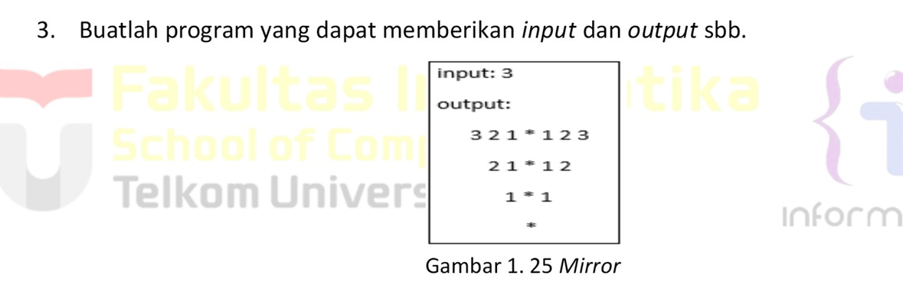
> 
```c++
#include <iostream>

using namespace std;

int main() {
    int n;
    cout << "Input: ";
    cin >> n;
    cout << "Output:" << endl;

    for (int baris = 0; baris < n; baris++) {
        for (int spasi = 0; spasi < baris; spasi++) {
            cout << "  ";
        }
        int angka_maks = n - baris;
        for (int j = angka_maks; j >= 1; j--) {
            cout << j << " ";
        }
        cout << "* ";
        for (int j = 1; j <= angka_maks; j++) {
            cout << j << " ";
        }
        cout << endl;
    }
    for (int k = 0; k < n; k++) {
        cout << "  ";
    }
    cout << "*" << endl;

    return 0;
}
```

> Output
> 
> 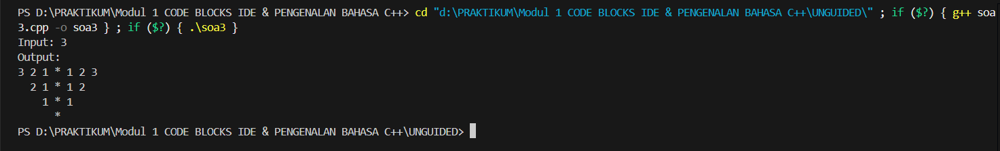

Output dari program ini adalah visualisasi dari kekuatan perulangan bersarang (nested loops) untuk menciptakan pola yang kompleks dan terstruktur. Berdasarkan input 3, program membangun piramida angka terbalik yang simetris. Ini dicapai melalui beberapa loop yang bekerja sama: satu loop luar untuk mengontrol setiap baris, dan beberapa loop di dalamnya yang bertugas untuk mencetak spasi untuk perataan, urutan angka menurun, simbol bintang di tengah, dan urutan angka menaik, yang secara kolektif membentuk pola yang presisi.

## Referensi

1. https://www.programiz.com/cpp-programming (diakses pada 27 september 2025)
2. https://www.learncpp.com/ (diakses pada 27 september 2025)
