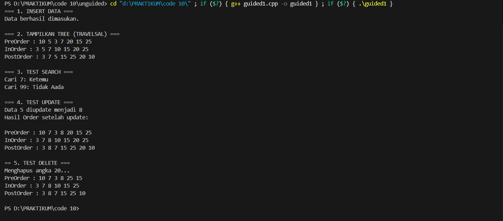
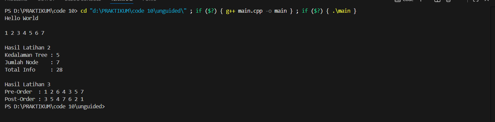

# <h1 align="center">Laporan Praktikum Modul 10 <br>TREE</h1>
<p align="center">MOHAMMAD REYHAN ARETHA FATIN - 103112400078</p>

## Dasar Teori
Rekursif didefinisikan sebagai suatu proses pengulangan dengan cara kesamaan diri, di mana sebuah fungsi atau prosedur memanggil dirinya sendiri. Dalam pemrograman, penggunaan sub-program rekursif memberikan manfaat berupa peningkatan readability (keterbacaan), modularity (pemecahan masalah menjadi modul kecil), dan reusability (penggunaan ulang tanpa penulisan ulang perintah). Agar tidak terjadi pengulangan tanpa henti (infinite loop), sebuah fungsi rekursif harus memenuhi dua kriteria utama: memiliki kondisi khusus (base case) yang menyebabkan pemanggilan berhenti, dan instruksi pemanggilan diri sendiri ketika kondisi khusus belum terpenuhi. Meskipun sering kali menghasilkan kode yang lebih singkat dan mudah dipahami, rekursif memiliki kekurangan yaitu membutuhkan memori lebih banyak untuk activation record dan waktu eksekusi yang lebih lama dibandingkan metode iteratif.

Struktur data Tree (pohon) adalah struktur data non-linear yang digambarkan sebagai graf tak berarah yang terhubung dan tidak mengandung sirkuit. Karakteristik utama dari tree meliputi adanya satu node tanpa pendahulu yang disebut akar (root), sementara node lainnya hanya memiliki satu pendahulu (parent). Terminologi penting dalam tree antara lain Leaf (daun) yang merupakan node berderajat nol, Internal Nodes (simpul dalam) yang memiliki anak, serta Height (tinggi) atau Depth (kedalaman) yang menunjukan jumlah maksimum node pada cabang tree tersebut. Terdapat berbagai jenis tree, salah satunya adalah Binary Tree di mana setiap node maksimal hanya memiliki dua anak.

Salah satu implementasi penting dari Binary Tree adalah Binary Search Tree (BST). BST adalah binary tree yang terurut dengan aturan ketat: semua nilai pada Left Child (sub-pohon kiri) harus lebih kecil dari parent-nya, dan semua nilai pada Right Child (sub-pohon kanan) harus lebih besar dari parent-nya. Aturan ini memungkinkan operasi pencarian (search), penambahan (insert), dan penghapusan (delete) dilakukan dengan efisien. Selain itu, penelusuran data (traversal) pada tree dapat dilakukan dengan tiga metode utama: Pre-order (Root-Left-Right), In-order (Left-Root-Right), dan Post-order (Left-Right-Root).
## Guided

### Guided 1
```c++
#include <iostream>
using namespace std;

struct Node
{
    int data;
    Node *kiri, *kanan;
};

Node *buatNode(int nilai)
{
    Node *baru = new Node();
    baru->data = nilai;
    baru->kiri = baru->kanan = NULL;
    return baru;
}

Node *insert(Node *root, int nilai)
{
    if (root == NULL)
        return buatNode(nilai);
    
    if (nilai < root->data)
        root->kiri = insert(root->kiri, nilai);
    else if (nilai > root->data)
        root->kanan = insert(root->kanan, nilai);

    return root;
}

Node *search(Node *root, int nilai)
{
    if (root == NULL || root->data == nilai)
        return root;

    if (nilai < root->data)
        return search(root->kiri, nilai);

    return search(root->kanan, nilai);
}

Node *nilaiTerkecil(Node *node)
{
    Node *current = node;
    while (current && current->kiri != NULL)
        current = current->kiri;

        return current;
}

Node *hapus(Node *root, int nilai)
{
    if (root == NULL)
        return root;

    if (nilai < root->data)
        root->kiri = hapus(root->kiri, nilai);
    else if (nilai > root->data)
        root->kanan = hapus(root->kanan, nilai);
    else
    {
        if (root->kiri == NULL)
        {
            Node *temp = root->kanan;
            delete root;
            return temp;
        }
        else if (root->kanan == NULL){
            Node *temp = root->kiri;
            delete root;
            return temp;
        }
        Node *temp = nilaiTerkecil(root->kanan);
        root->data = temp->data;
        root->kanan = hapus(root->kanan, temp->data);
    }
    return root;
}

Node *update(Node *root, int Lama, int baru)
{
    if (search(root, Lama) != NULL)
    {
        root = hapus(root, Lama);
        root = insert(root, baru);
        cout << "Data " << Lama << " diupdate menjadi " << baru << endl;
    }
    else
    {
        cout << "Data " << Lama << " tidak ditemukan!" << endl;
    }
    return root;
}

void preOrder(Node *root)
{
    if (root != NULL)
    {
        cout << root->data << " ";
        preOrder(root->kiri);
        preOrder(root->kanan);
    }
}

void inOrder(Node *root)
{
    if (root != NULL)
    {
        inOrder(root->kiri);
        cout << root->data << " ";
        inOrder(root->kanan);
    }
}

void postOrder(Node *root)
{
    if (root != NULL)
    {
        postOrder(root->kiri);
        postOrder(root->kanan);
        cout << root->data << " ";
    }
}

int main()
{
    Node *root = NULL;

    cout << "=== 1. INSERT DATA ===" << endl;
    root = insert(root, 10);
    insert(root, 5);
    insert(root, 20);
    insert(root, 3);
    insert(root, 7);
    insert(root, 15);
    insert(root, 25);
    cout << "Data berhasil dimasukan.\n" << endl;

    cout << "=== 2. TAMPILKAN TREE (TRAVELSAL) ===" << endl;
    cout << "PreOrder : ";
    preOrder(root);
    cout << endl;
    cout << "InOrder : ";
    inOrder(root);
    cout << endl;
    cout << "PostOrder : ";
    postOrder(root);
    cout << "\n" << endl;

    cout << "=== 3. TEST SEARCH ===" << endl;
    int cari1 = 7, cari2 = 99;
    cout << "Cari " << cari1 << ": " << (search(root,cari1) ? "Ketemu" : "Tidak Aada") << endl;
    cout << "Cari " << cari2 << ": " << (search(root,cari2) ? "Ketemu" : "Tidak Aada") << endl;
    cout << endl;

    cout << "=== 4. TEST UPDATE ===" << endl;
    root = update(root, 5, 8);
    cout << "Hasil Order setelah update: ";
    cout << endl;
    cout << endl;

    cout << "PreOrder : ";
    preOrder(root);
    cout << endl;
    cout << "InOrder : ";
    inOrder(root);
    cout << endl;
    cout << "PostOrder : ";
    postOrder(root);
    cout << "\n" << endl;

    cout << "== 5. TEST DELETE ===" << endl;
    cout << "Menghapus angka 20..." << endl;
    root = hapus(root, 20);

    cout << "PreOrder : ";
    preOrder(root);
    cout << endl;
    cout << "InOrder : ";
    inOrder(root);
    cout << endl;
    cout << "PostOrder : ";
    postOrder(root);
    cout << "\n" << endl;

    return 0;
}
```

> Output
> 
> 

Program ini adalah implementasi BST komprehensif dalam satu file tunggal yang menyediakan fitur lengkap CRUD (Create, Read, Update, Delete). Keunggulannya terletak pada penanganan logika yang lebih kompleks, seperti pencarian data, pembaruan nilai (dengan metode hapus lalu sisip ulang), serta algoritma penghapusan node yang mampu menangani berbagai kondisi anak (leaf, satu anak, atau dua anak).

## UNGUIDED

#### bstree.h
```c++

```
#### bstree.cpp
```c++

```
#### main.cpp
```c++

```
> Output soal 1
> 
> 

Program ini adalah implementasi Binary Search Tree (BST) modular yang membagi kode menjadi tiga file terpisah (header, implementasi, dan main). Fokus utamanya adalah operasi dasar: penyisipan data (insert), tiga jenis penelusuran (traversal), dan fungsi statistik untuk menghitung kedalaman, jumlah node, serta total nilai data dalam tree.


## Referensi

1. https://www.geeksforgeeks.org/cpp/cpp-binary-search-tree/ (diakses pada 29 November 2025)
2. https://www.geeksforgeeks.org/dsa/deletion-in-binary-search-tree/ (diakses pada 29 November 2025)
3. https://www.geeksforgeeks.org/dsa/tree-traversals-inorder-preorder-and-postorder/ (diakses pada 29 November 2025)
