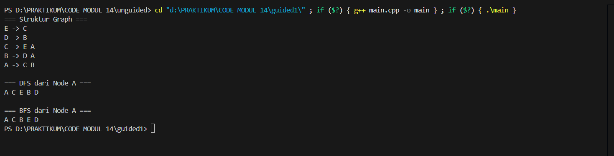
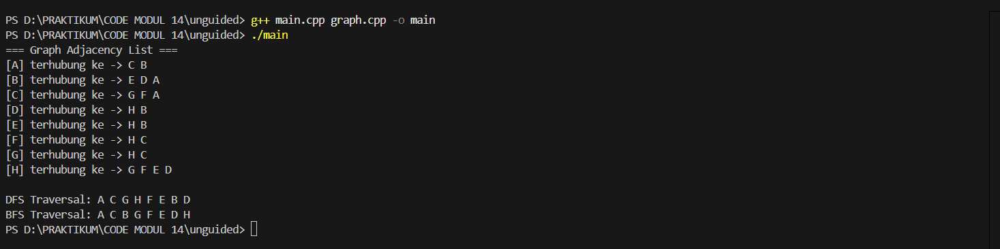

# <h1 align="center">Laporan Praktikum Modul 14 <br>GRAPH</h1>
<p align="center">MOHAMMAD REYHAN ARETHA FATIN - 103112400078</p>

## Dasar Teori
Graph didefinisikan sebagai himpunan tidak kosong yang terdiri dari node (disebut juga vertex) dan garis penghubung (disebut edge). Struktur data ini digunakan untuk merepresentasikan hubungan antar objek. Sebagai contoh sederhana dalam kehidupan sehari-hari, lokasi seperti "Tempat Kost" dan "Common Lab" dapat dianggap sebagai node (vertex), sedangkan jalan yang menghubungkan keduanya merepresentasikan edge.

Secara umum, graph dibedakan menjadi dua jenis utama berdasarkan arah hubungannya. Pertama adalah Directed Graph (Graph Berarah), di mana setiap edge memiliki arah spesifik dari satu node ke node lainnya. Dalam representasi ini, jika Node A terhubung ke Node B, belum tentu Node B terhubung kembali ke Node A. Kedua adalah Undirected Graph (Graph Tidak Berarah), di mana edge menghubungkan node tanpa arah tertentu, sehingga hubungan bersifat dua arah (bidirectional). Selain itu, dua node dikatakan "bertetangga" jika keduanya dihubungkan langsung oleh sebuah edge.

## Guided

### Guided 1
#### graf.h
```c++
#ifndef GRAF_H_INCLUDED
#define GRAF_H_INCLUDED

#include <iostream>
using namespace std;

typedef char infoGraph;

struct ElmNode;
struct ElmEdge;

typedef ElmNode *adrNode;
typedef ElmEdge *adrEdge;

struct ElmNode
{
    infoGraph info;
    int visited;
    adrEdge firstEdge;
    adrNode next;
};

struct ElmEdge
{
    adrNode node;
    adrEdge next;
};

struct Graph
{
    adrNode first;
};

// PRIMITIF GRAPH
void CreateGraph(Graph &G);
adrNode AllocateNode(infoGraph X);
adrEdge AllocateEdge(adrNode N);

void InsertNode(Graph &G, infoGraph X);
adrNode FindNode(Graph G, infoGraph X);

void ConnectNode(Graph &G, infoGraph A, infoGraph B);

void PrintInfoGraph(Graph G);

// Traversal
void ResetVisited(Graph &G);
void PrintDFS(Graph &G, adrNode N);
void PrintBFS(Graph &G, adrNode N);

#endif
```
#### graf.cpp
```c++
#include "graf.h"
#include <queue>
#include <stack>

void CreateGraph(Graph &G)
{
    G.first = NULL;
}

adrNode AllocateNode(infoGraph X)
{
    adrNode P = new ElmNode;
    P->info = X;
    P->visited = 0;
    P->firstEdge = NULL;
    P->next = NULL;
    return P;
}

adrEdge AllocateEdge(adrNode N)
{
    adrEdge P = new ElmEdge;
    P->node = N;
    P->next = NULL;
    return P;
}

void InsertNode(Graph &G, infoGraph X)
{
    adrNode P = AllocateNode(X);
    P->next = G.first;
    G.first = P;
}

adrNode FindNode(Graph G, infoGraph X)
{
    adrNode P = G.first;
    while (P != NULL)
    {
        if (P->info == X)
            return P;
        P = P->next;
    }
    return NULL;
}

void ConnectNode(Graph &G, infoGraph A, infoGraph B)
{
    adrNode N1 = FindNode(G, A);
    adrNode N2 = FindNode(G, B);

    if (N1 == NULL || N2 == NULL)
    {
        cout << "Node tidak ditemukan!\n";
        return;
    }

    // Buat edge dari N1 ke N2
    adrEdge E1 = AllocateEdge(N2);
    E1->next = N1->firstEdge;
    N1->firstEdge = E1;

    // Karena undirected → buat edge balik
    adrEdge E2 = AllocateEdge(N1);
    E2->next = N2->firstEdge;
    N2->firstEdge = E2;
}

void PrintInfoGraph(Graph G)
{
    adrNode P = G.first;
    while (P != NULL)
    {
        cout << P->info << " -> ";
        adrEdge E = P->firstEdge;
        while (E != NULL)
        {
            cout << E->node->info << " ";
            E = E->next;
        }
        cout << endl;
        P = P->next;
    }
}

void ResetVisited(Graph &G)
{
    adrNode P = G.first;
    while (P != NULL)
    {
        P->visited = 0;
        P = P->next;
    }
}

void PrintDFS(Graph &G, adrNode N)
{
    if (N == NULL)
        return;

    N->visited = 1;
    cout << N->info << " ";

    adrEdge E = N->firstEdge;
    while (E != NULL)
    {
        if (E->node->visited == 0)
        {
            PrintDFS(G, E->node);
        }
        E = E->next;
    }
}

void PrintBFS(Graph &G, adrNode N)
{
    if (N == NULL)
        return;

    queue<adrNode> Q;
    Q.push(N);

    while (!Q.empty())
    {
        adrNode curr = Q.front();
        Q.pop();

        if (curr->visited == 0)
        {
            curr->visited = 1;
            cout << curr->info << " ";

            adrEdge E = curr->firstEdge;
            while (E != NULL)
            {
                if (E->node->visited == 0)
                {
                    Q.push(E->node);
                }
                E = E->next;
            }
        }
    }
}

```
#### main.cpp
```c++
#include "graf.h"
#include "graf.cpp"
#include <iostream>
using namespace std;

int main()
{
    Graph G;
    CreateGraph(G);

    // Tambah node
    InsertNode(G, 'A');
    InsertNode(G, 'B');
    InsertNode(G, 'C');
    InsertNode(G, 'D');
    InsertNode(G, 'E');

    // Hubungkan node (graph tidak berarah)
    ConnectNode(G, 'A', 'B');
    ConnectNode(G, 'A', 'C');
    ConnectNode(G, 'B', 'D');
    ConnectNode(G, 'C', 'E');

    cout << "=== Struktur Graph ===\n";
    PrintInfoGraph(G);

    cout << "\n=== DFS dari Node A ===\n";
    ResetVisited(G);
    PrintDFS(G, FindNode(G, 'A'));

    cout << "\n\n=== BFS dari Node A ===\n";
    ResetVisited(G);
    PrintBFS(G, FindNode(G, 'A'));

    cout << endl;
    return 0;
}

```

> Output
> 
> 


## UNGUIDED 1,2,3
#### code
#### graph.h
```c++

```
#### graph.cpp
```c++

```
#### main.cpp
```c++

```
> Output soal 1
> 
> 


## Referensi

1.  (diakses pada 14 Desember 2025)
2.  (diakses pada 14 Desember 2025)
3.  (diakses pada 14 Desember 2025)
