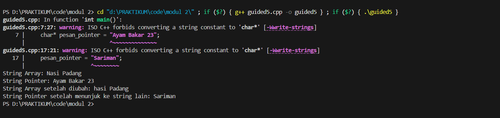

# <h1 align="center">Laporan Praktikum Modul 2 <br> PENGENALAN BAHASA C++ (BAGIAN KEDUA)</h1>
<p align="center">NUFAIL ALAUDDIN TSAQIF - 103112400084</p>

## Dasar Teori

## Guided

### Guided 1
```c++
#include <iostream>
using namespace std;

int main(){
    int nilai[5] = {1, 2, 3, 4, 5};
    for (int i = 0; i < 5; ++i)
    {
        cout << "Elemen ke-" << i << " = " << nilai[i] << endl;
    }
    return 0;
}
```
> Output
> 
> 


### Guided 2
```c++
#include <iostream>
using namespace std;

int main()
{
    int matrix[3][3]={
        {1,2,3},
        {4,5,6},
        {7,8,9}};
    
    for (int i=0; i <3; ++i)
    {
        for (int j=0; j<3; ++j)
        {
            cout << matrix[i][j]<< " ";
        }
        cout << endl;
    }
}
```
> Output
> 
> 

Kode ini menunjukkan cara menginisialisasi dan menampilkan sebuah array dua dimensi atau matriks berukuran 3x3. Program menggunakan dua perulangan for yang bersarang perulangan luar (i) berfungsi untuk berpindah baris, sementara perulangan dalam (j) berfungsi untuk mengakses dan mencetak setiap elemen dalam kolom di baris tersebut, diikuti dengan endl untuk pindah ke baris baru setelah satu baris selesai dicetak.

### Guided 3
```c++
#include <iostream>
using namespace std;
int main()
{
    int umur = 25;
    int *p_umur;

    p_umur = &umur;

    cout << "Nilai 'umur' : " << umur << endl;
    cout << "Alamat memori 'umur' : " << &umur << endl;
    cout << "Nilai 'p_umur' (alamat) : " << p_umur << endl;
    cout << "Nilai yang diakses 'umur' : " << umur << endl;
    cout << "Alamat memori dari pointer 'p_umur' itu sendiri : " << &p_umur << endl;

    return 0;
}

```
> Output
> 
> 

Program ini menjelaskan konsep dasar pointer dalam C++. Sebuah variabel pointer p_umur dideklarasikan untuk menyimpan alamat memori dari variabel umur (menggunakan operator &). Kode ini kemudian menampilkan nilai asli dari umur, alamat memori umur yang juga merupakan nilai yang disimpan oleh p_umur, serta nilai yang diakses melalui pointer *p_umur (dereferensi), dan terakhir menunjukkan bahwa pointer itu sendiri juga memiliki alamat memorinya sendiri.

### Guided 4
```c++
#include <iostream>
using namespace std;

int main()
{
    int data[5] = {10, 20, 30, 40, 50};
    int *p_data = data;

    cout << "Mengakses elemen array cara normal: " << endl;

    for (int i = 0; i < 5; ++i)
    {
        cout << "Nilai elemen ke- " << i << ": " << data[i] << endl;
    }

    cout << "Mengakses elemen array menggunakan pointer:" << endl;

    for (int i = 0; i < 5; ++i)
    {
        cout << "Nilai elemen ke-" << i << ": " << *(p_data + i) << endl;
    }
    return 0;
}
```
> Output
> 
> 

Kode ini membandingkan dua cara untuk mengakses elemen-elemen dalam sebuah array: menggunakan cara biasa dengan indeks dan menggunakan pointer. Cara pertama menggunakan data[i] dalam perulangan for. Cara kedua menunjukkan bahwa nama array (data) pada dasarnya adalah pointer ke elemen pertama, sehingga elemen-elemen berikutnya dapat diakses menggunakan aritmatika pointer, yaitu dengan *(p_data + i) untuk mendapatkan nilai pada alamat yang telah digeser sebanyak i elemen.

### Guided 5
```c++
#include <iostream>
using namespace std;

int main()
{
    char pesan_array[] = "Nasi Padang";
    char* pesan_pointer = "Ayam Bakar 23";

    cout << "String Array: " << pesan_array << endl;
    cout << "String Pointer: " << pesan_pointer << endl;

    // Mengubah karakter dalam array diperbolehkan
    pesan_array[0] = 'h';
    cout << "String Array setelah diubah: " << pesan_array << endl;

    // Pointer dapat diubah untuk menunjuk ke string lain
    pesan_pointer = "Sariman";
    cout << "String Pointer setelah menunjuk ke string lain: " << pesan_pointer << endl;

    return 0;
}
```
> Output
> 
> 

Program ini menunjukkan perbedaan antara mendeklarasikan string sebagai character array (char[]) dan sebagai character pointer (char*). String yang dideklarasikan sebagai array (pesan_array) dialokasikan di memori stack dan isinya dapat diubah karakter per karakter. Sebaliknya, string yang dideklarasikan sebagai pointer (pesan_pointer) menunjuk ke sebuah string literal yang tersimpan di memori read-only, sehingga isinya tidak dapat diubah, namun pointernya sendiri bisa diarahkan untuk menunjuk ke string lain.

### Guided 6
```c++
#include <iostream>

int hitungJumlah(int a, int b)
{
    return a + b;
}

void tampilkanHasil(int hasil)
{
    std::cout << "Hasil penjumlahannya adalah: " << hasil << std::endl;
}

int main()
{
    int angka1 = 15;
    int angka2 = 10;
    int hasilJumlah;

    hasilJumlah = hitungJumlah(angka1, angka2);
    tampilkanHasil(hasilJumlah);

    return 0;
}
```
> Output
> 
> 

Kode ini mendemonstrasikan dasar-dasar penggunaan fungsi untuk membuat program yang modular. Terdapat dua fungsi: hitungJumlah yang menerima dua integer, menjumlahkannya, dan mengembalikan hasilnya, serta tampilkanHasil yang merupakan fungsi void untuk menampilkan hasil ke layar. Fungsi main bertindak sebagai titik utama eksekusi yang memanggil kedua fungsi tersebut secara berurutan untuk menjalankan tugasnya, yaitu menghitung dan menampilkan hasil penjumlahan.

### Guided 7
```c++
#include <iostream>
using namespace std;

void tukar(int *px, int *py)
{
    int temp = *px;
    *px = *py;
    *py = temp;
}

int main()
{
    int a = 10, b = 20;
    cout << "Sebelum ditukar: a = " << a << ", b = " << b << endl;
    tukar(&a, &b);
    cout << "Setelah ditukar: a = " << a << ", b = " << b << endl;
    return 0;
}
```
> Output
> 
> 

Program ini menunjukkan cara menukar nilai dua variabel menggunakan metode call by pointer. Fungsi tukar menerima dua parameter berupa pointer integer (int *px, int *py), yang diisi dengan alamat memori dari variabel a dan b saat dipanggil (tukar(&a, &b)). Di dalam fungsi, operator dereferensi (*) digunakan untuk mengakses dan memanipulasi nilai yang ada di alamat tersebut, sehingga perubahan nilai terjadi langsung pada variabel a dan b di fungsi main.

### Guided 8
```c++
#include <iostream>
using namespace std;

void tukar(int &x, int &y)
{
    int temp = x;
    x = y;
    y = temp;
}

int main()
{
    int a = 10, b = 20;
    cout << "Sebelum ditukar: a = " << a << ", b = " << b << endl;
    tukar(a, b);
    cout << "Setelah ditukar: a = " << a << ", b = " << b << endl;
    return 0;
}
```
> Output
> 
> 

Kode ini juga bertujuan menukar nilai dua variabel, tetapi menggunakan metode call by reference yang lebih modern di C++. Fungsi tukar menerima parameter sebagai referensi (int &x, int &y), yang membuatnya menjadi alias atau nama lain untuk variabel a dan b yang dilewatkan. Dengan demikian, setiap perubahan pada x dan y di dalam fungsi secara otomatis akan mengubah nilai asli dari a dan b di fungsi main tanpa perlu menggunakan sintaks pointer.

## Unguided

### Soal 1


```c++

```

> Output
> 
> 

Kode ini juga bertujuan menukar nilai dua variabel, tetapi menggunakan metode call by reference yang lebih modern di C++. Fungsi tukar menerima parameter sebagai referensi (int &x, int &y), yang membuatnya menjadi alias atau nama lain untuk variabel a dan b yang dilewatkan. Dengan demikian, setiap perubahan pada x dan y di dalam fungsi secara otomatis akan mengubah nilai asli dari a dan b di fungsi main tanpa perlu menggunakan sintaks pointer.

### Soal 2

Buatlah program yang menunjukkan penggunaan call by reference. Buat sebuah prosedur bernama kuadratkan yang menerima satu parameter integer secara referensi (&). Prosedur ini akan mengubah nilai asli variabel yang dilewatkan dengan nilai kuadratnya. Tampilkan nilai variabel di main() sebelum dan sesudah memanggil prosedur untuk membuktikan perubahannya.

```c++

```

> Output
> 
> 


## Referensi

1. https://www.learncpp.com/ (diakses pada 27 september 2025)
2. https://www.w3schools.com/cpp/ (diakses pada 27 september 2025)
3. https://www.geeksforgeeks.org/cpp/ (diakses pada 27 september 2025)
