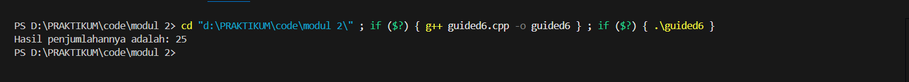

# <h1 align="center">Laporan Praktikum Modul 2 <br> PENGENALAN BAHASA C++ (BAGIAN KEDUA)</h1>
<p align="center">NUFAIL ALAUDDIN TSAQIF - 103112400084</p>

## Dasar Teori

Pointer adalah sebuah variabel spesial dalam C++ yang fungsinya bukan untuk menyimpan nilai data, melainkan untuk menyimpan alamat memori dari variabel lain. Konsep ini memungkinkan manipulasi data secara tidak langsung, yang sangat berguna untuk alokasi memori dinamis dan efisiensi dalam pemanggilan fungsi. Dua operator fundamental yang berkaitan dengan pointer adalah operator address-of (&) yang digunakan untuk mendapatkan alamat memori sebuah variabel, dan operator dereferensi (*) yang digunakan untuk mengakses atau memodifikasi nilai yang berada di alamat memori yang ditunjuk oleh pointer.

Dalam pemanggilan fungsi, cara sebuah argumen dilewatkan ke parameter fungsi sangat menentukan bagaimana data tersebut akan diperlakukan. Metode pertama dan yang menjadi default adalah call by value. Pada metode ini, fungsi akan membuat salinan dari argumen yang dilewatkan. Akibatnya, segala perubahan yang terjadi pada parameter di dalam fungsi bersifat lokal dan tidak akan memengaruhi variabel asli yang ada di luar fungsi. Cara ini aman karena tidak mengubah data asli, tetapi tidak efisien jika data yang disalin berukuran besar.

Metode kedua adalah call by reference, yang bertujuan untuk mengatasi keterbatasan call by value. Metode ini dapat diimplementasikan menggunakan dua cara di C++. Cara pertama adalah dengan melewatkan pointer sebagai argumen. Dengan cara ini, yang dikirim ke fungsi adalah alamat memori dari variabel asli. Untuk memanipulasi data asli, fungsi harus melakukan dereferensi (*) pada pointer tersebut. Cara ini memberikan fungsi kemampuan untuk mengubah nilai variabel asli secara permanen.

Cara kedua, yang lebih modern dan sering dianggap lebih aman di C++, adalah call by reference menggunakan referensi (&). Sebuah referensi pada dasarnya adalah nama lain atau alias untuk variabel yang sudah ada. Ketika sebuah referensi dilewatkan ke fungsi, fungsi tersebut dapat mengubah variabel asli secara langsung dengan sintaks yang lebih bersih dan sederhana, seolah-olah bekerja pada variabel itu sendiri tanpa perlu menggunakan operator dereferensi. Metode ini menggabungkan kekuatan modifikasi data asli seperti pointer dengan kemudahan penggunaan seperti call by value.

## Guided

### Guided 1
```c++
#include <iostream>
using namespace std;

int main(){
    int nilai[5] = {1, 2, 3, 4, 5};
    for (int i = 0; i < 5; ++i)
    {
        cout << "Elemen ke-" << i << " = " << nilai[i] << endl;
    }
    return 0;
}
```
> Output
> 
> 

Program C++ ini adalah contoh implementasi call by reference. Dengan melewatkan argumen sebagai referensi (int& angka), fungsi kuadratkan mendapatkan akses langsung ke alamat memori variabel bilangan dari fungsi main. Alih-alih bekerja pada salinan data, fungsi ini memanipulasi data asli di lokasi penyimpanannya. Oleh karena itu, modifikasi apa pun yang terjadi di dalam fungsi akan tetap berlaku bahkan setelah fungsi selesai dieksekusi, seperti yang ditunjukkan oleh perubahan nilai variabel sebelum dan sesudah pemanggilan fungsi pada output.

### Guided 2
```c++
#include <iostream>
using namespace std;

int main()
{
    int matrix[3][3]={
        {1,2,3},
        {4,5,6},
        {7,8,9}};
    
    for (int i=0; i <3; ++i)
    {
        for (int j=0; j<3; ++j)
        {
            cout << matrix[i][j]<< " ";
        }
        cout << endl;
    }
}
```
> Output
> 
> 

Program ini bertujuan untuk menampilkan isi dari sebuah array dua dimensi atau matriks. Program mendeklarasikan sebuah matriks berukuran 3x3 dan mengisinya dengan angka 1 sampai 9. Kemudian, program menggunakan perulangan bersarang (nested loop) untuk mencetak setiap elemen matriks baris per baris, sehingga menghasilkan tampilan matriks yang rapi di layar.

### Guided 3
```c++
#include <iostream>
using namespace std;
int main()
{
    int umur = 25;
    int *p_umur;

    p_umur = &umur;

    cout << "Nilai 'umur' : " << umur << endl;
    cout << "Alamat memori 'umur' : " << &umur << endl;
    cout << "Nilai 'p_umur' (alamat) : " << p_umur << endl;
    cout << "Nilai yang diakses 'umur' : " << umur << endl;
    cout << "Alamat memori dari pointer 'p_umur' itu sendiri : " << &p_umur << endl;

    return 0;
}

```
> Output
> 
> 

Program ini mendemonstrasikan konsep dasar pointer dalam C++. Program ini mendeklarasikan variabel umur dengan nilai 25, lalu sebuah pointer p_umur dibuat untuk menyimpan alamat memori dari variabel umur. Outputnya menunjukkan bahwa kita bisa mendapatkan nilai asli (25) baik dari variabel umur langsung maupun melalui dereferensi pointer (*p_umur), serta menampilkan alamat memori dari masing-masing variabel tersebut.

### Guided 4
```c++
#include <iostream>
using namespace std;

int main()
{
    int data[5] = {10, 20, 30, 40, 50};
    int *p_data = data;

    cout << "Mengakses elemen array cara normal: " << endl;

    for (int i = 0; i < 5; ++i)
    {
        cout << "Nilai elemen ke- " << i << ": " << data[i] << endl;
    }

    cout << "Mengakses elemen array menggunakan pointer:" << endl;

    for (int i = 0; i < 5; ++i)
    {
        cout << "Nilai elemen ke-" << i << ": " << *(p_data + i) << endl;
    }
    return 0;
}
```
> Output
> 
> 

Program ini membandingkan dua cara untuk mengakses elemen dalam sebuah array. Cara pertama adalah metode standar menggunakan indeks (misalnya array[i]). Cara kedua adalah dengan menggunakan pointer, di mana sebuah pointer diarahkan ke elemen pertama array, lalu pointer tersebut digerakkan maju untuk mengakses elemen-elemen berikutnya secara berurutan. Kedua metode ini pada akhirnya menghasilkan output yang sama persis.

### Guided 5
```c++
#include <iostream>
using namespace std;

int main()
{
    char pesan_array[] = "Nasi Padang";
    char* pesan_pointer = "Ayam Bakar 23";

    cout << "String Array: " << pesan_array << endl;
    cout << "String Pointer: " << pesan_pointer << endl;

    // Mengubah karakter dalam array diperbolehkan
    pesan_array[0] = 'h';
    cout << "String Array setelah diubah: " << pesan_array << endl;

    // Pointer dapat diubah untuk menunjuk ke string lain
    pesan_pointer = "Sariman";
    cout << "String Pointer setelah menunjuk ke string lain: " << pesan_pointer << endl;

    return 0;
}
```
> Output
> 
> 

Program ini menunjukkan penggunaan pointer untuk menunjuk ke sebuah string literal (teks konstan). Awalnya, pointer pesan_pointer diarahkan untuk menunjuk ke teks "Ayam Bakar 23". Kemudian, program mengubah arah pointer tersebut sehingga menunjuk ke teks lain, yaitu "Sariman". Program ini juga menampilkan warning saat kompilasi karena mencoba menugaskan teks konstan ke char* yang tidak konstan, yang merupakan praktik yang tidak disarankan dalam standar C++ modern.

### Guided 6
```c++
#include <iostream>

int hitungJumlah(int a, int b)
{
    return a + b;
}

void tampilkanHasil(int hasil)
{
    std::cout << "Hasil penjumlahannya adalah: " << hasil << std::endl;
}

int main()
{
    int angka1 = 15;
    int angka2 = 10;
    int hasilJumlah;

    hasilJumlah = hitungJumlah(angka1, angka2);
    tampilkanHasil(hasilJumlah);

    return 0;
}
```
> Output
> 
> 

Program ini adalah contoh sederhana dari sebuah fungsi penjumlahan yang menggunakan pointer. Dua buah variabel angka dikirimkan ke sebuah fungsi, bukan sebagai nilai, melainkan sebagai alamat memori (pointer). Fungsi tersebut kemudian mengakses nilai dari kedua alamat tersebut, menjumlahkannya, dan mengembalikan hasil penjumlahannya, yaitu 25.

### Guided 7
```c++
#include <iostream>
using namespace std;

void tukar(int *px, int *py)
{
    int temp = *px;
    *px = *py;
    *py = temp;
}

int main()
{
    int a = 10, b = 20;
    cout << "Sebelum ditukar: a = " << a << ", b = " << b << endl;
    tukar(&a, &b);
    cout << "Setelah ditukar: a = " << a << ", b = " << b << endl;
    return 0;
}
```
> Output
> 
> 

rogram ini mendemonstrasikan cara menukar dua nilai menggunakan call by reference, sebuah metode yang efisien di C++. Bayangkan variabel a dan b adalah tulisan di sebuah papan tulis yang sama. Saat fungsi tukar dipanggil, kita tidak memberikan salinan tulisan itu di kertas lain. Sebaliknya, kita hanya memberi tahu fungsi tukar: "Untuk sementara, sebut saja tulisan a sebagai x dan tulisan b sebagai y." Karena x dan y hanyalah nama lain untuk tulisan di papan tulis yang sama, saat fungsi tukar menghapus dan menulis ulang nilai x dan y, ia sebenarnya sedang mengubah tulisan asli a dan b secara langsung.

### Guided 8
```c++
#include <iostream>
using namespace std;

void tukar(int &x, int &y)
{
    int temp = x;
    x = y;
    y = temp;
}

int main()
{
    int a = 10, b = 20;
    cout << "Sebelum ditukar: a = " << a << ", b = " << b << endl;
    tukar(a, b);
    cout << "Setelah ditukar: a = " << a << ", b = " << b << endl;
    return 0;
}
```
> Output
> 
> 

Kode ini juga bertujuan menukar nilai dua variabel, tetapi menggunakan metode call by reference yang lebih modern di C++. Fungsi tukar menerima parameter sebagai referensi (int &x, int &y), yang membuatnya menjadi alias atau nama lain untuk variabel a dan b yang dilewatkan. Dengan demikian, setiap perubahan pada x dan y di dalam fungsi secara otomatis akan mengubah nilai asli dari a dan b di fungsi main tanpa perlu menggunakan sintaks pointer.

## Unguided

### Soal 1


```c++
#include <iostream>
using namespace std;

int main() {
    int matrix[3][3] = {
        {1, 2, 3},
        {4, 5, 6},
        {7, 8, 9}
    };

    for (int i = 0; i < 3; ++i) {
        for (int j = i + 1; j < 3; ++j) {
            int temp = matrix[i][j];
            matrix[i][j] = matrix[j][i];
            matrix[j][i] = temp;
        }
    }

    cout << "\nMatriks Setelah di-Transpose:" << endl;
    for (int i = 0; i < 3; ++i) {
        for (int j = 0; j < 3; ++j) {
            cout << matrix[i][j] << " ";
        }
        cout << endl;
    }

    return 0;
}
```

> Output
> 
> 

Program ini menunjukkan bagaimana sebuah fungsi dapat mengubah nilai variabel secara permanen menggunakan pass by reference. Awalnya, ada sebuah variabel dengan nilai 5. Variabel tersebut kemudian dikirim ke sebuah fungsi yang mengalikan nilai tersebut dengan dirinya sendiri (kuadrat). Karena dikirim sebagai referensi (alamat memorinya), perubahan yang terjadi di dalam fungsi akan langsung diterapkan pada variabel asli, sehingga nilai akhirnya menjadi 25.
### Soal 2

Buatlah program yang menunjukkan penggunaan call by reference. Buat sebuah prosedur bernama kuadratkan yang menerima satu parameter integer secara referensi (&). Prosedur ini akan mengubah nilai asli variabel yang dilewatkan dengan nilai kuadratnya. Tampilkan nilai variabel di main() sebelum dan sesudah memanggil prosedur untuk membuktikan perubahannya.

```c++
#include <iostream>
using namespace std;

int kuadratkan(int angka) {
    return angka * angka;
}

int main() {
    int bilangan = 5;
    cout << "Nilai awal: " << bilangan << endl;
    
    bilangan = kuadratkan(bilangan);
    
    cout << "Nilai setelah dikuadratkan: " << bilangan << endl;
    return 0;
}
```

> Output
> 
> 

Program ini melakukan operasi transpos pada sebuah matriks 3x3. Matriks transpos adalah matriks baru yang diperoleh dengan cara menukar elemen baris menjadi elemen kolom dan sebaliknya. Program pertama-tama menampilkan matriks asli, kemudian menghitung dan menampilkan matriks hasil transposnya, di mana baris pertama matriks asli (1 2 3) menjadi kolom pertama matriks baru, dan seterusnya.

## Referensi

1. https://www.tutorialspoint.com/cplusplus/cpp_function_call_by_reference.htm (diakses pada 5 Oktober 2025)
2. https://www.petanikode.com/cpp-pointer/ (diakses pada 5 Oktober 2025)
3. https://learn.microsoft.com/en-us/cpp/cpp/pointers-cpp (diakses pada 5 Oktober 2025)
