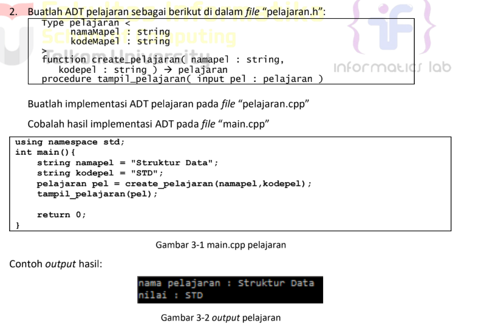
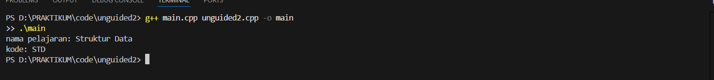
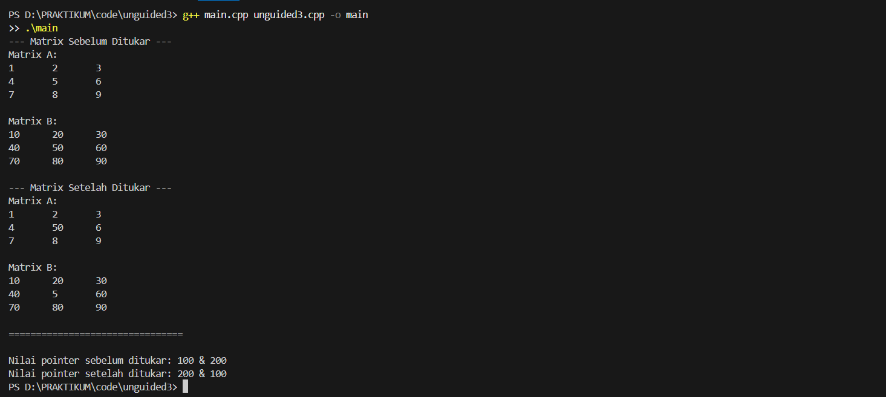

# <h1 align="center">Laporan Praktikum Modul 3 <br> ABSTRACT DATA TYPE</h1>
<p align="center">NUFAIL ALAUDDIN TSAQIF - 103112400084</p>

## Dasar Teori
Abstract Data Type (ADT) adalah sebuah model matematis yang mendefinisikan sebuah tipe data beserta sekumpulan operasi dasar (primitif) terhadap tipe tersebut, tanpa mengungkap bagaimana tipe data tersebut diimplementasikan. Konsep ini memungkinkan pemisahan antara spesifikasi (apa yang dilakukan oleh tipe data) dan implementasi (bagaimana hal itu dilakukan), yang merupakan prinsip dasar dalam rekayasa perangkat lunak. ADT bersifat statik, artinya definisinya ditentukan pada saat kompilasi dan tidak berubah selama eksekusi program. Sebuah ADT bahkan dapat tersusun dari ADT lainnya, misalnya ADT Waktu yang terdiri dari ADT Jam dan ADT Tanggal

Operasi-operasi dasar atau primitif pada ADT dikelompokkan ke dalam beberapa kategori. Konstruktor atau kreator berfungsi untuk menciptakan atau membentuk nilai dari tipe ADT tersebut. Selektor digunakan untuk mengakses komponen-komponen dari tipe data. Selain itu, terdapat juga operator relasional untuk perbandingan (seperti lebih besar dari, sama dengan) , operator aritmatika untuk operasi hitung , prosedur I/O untuk interaksi dengan perangkat masukan/keluaran , serta destruktor untuk melepaskan memori yang digunakan oleh objek ADT.

Dalam implementasinya menggunakan bahasa C++, konsep ADT biasanya diwujudkan dengan memisahkan kode ke dalam dua jenis file utama. File pertama adalah header file dengan ekstensi .h, yang berisi definisi atau spesifikasi tipe data (umumnya menggunakan struct atau class) beserta deklarasi header dari fungsi-fungsi primitifnya. File kedua adalah source file dengan ekstensi .cpp, yang berisi kode program atau realisasi dari setiap fungsi primitif yang telah dideklarasikan di file header. File utama program (misalnya, main.cpp) kemudian dapat menggunakan ADT tersebut dengan menyertakan file header-nya (#include "namafile.h").

## Guided

### mahasiswa.h
```c++
#ifndef MAHASISWA_H_INCLUDED
#define MAHASISWA_H_INCLUDED
struct mahasiswa
{
    char nim[10];
    int nilai1, nilai2;
};
void inputMhs(mahasiswa &m);
float rata2(mahasiswa m);
#endif
```
Program ini adalah sebuah file header yang fungsinya adalah untuk mendeklarasikan komponen-komponen yang akan digunakan bersama oleh file-file .cpp lainnya. Di dalamnya, Anda mendefinisikan sebuah tipe data struct baru bernama mahasiswa yang mengelompokkan tiga variabel: nim, nilai1, dan nilai2. Selain itu, file ini juga berisi prototipe fungsi untuk inputMhs dan rata2. Prototipe ini memberitahu kompiler tentang nama fungsi, tipe data yang dikembalikan (return type), dan parameter yang dibutuhkannya, tanpa menjelaskan isi atau logika dari fungsi tersebut. Tujuannya adalah agar file lain yang menyertakan (#include) header ini tahu cara menggunakan struct mahasiswa dan fungsi-fungsi tersebut.

### mahasiswa.cpp
```c++
#ifndef MAHASISWA_H_INCLUDED
#define MAHASISWA_H_INCLUDED
struct mahasiswa
{
    char nim[10];
    int nilai1, nilai2;
};
void inputMhs(mahasiswa &m);
float rata2(mahasiswa m);
#endif
```
Program ni adalah file sumber (source file) yang berisi definisi atau implementasi kode dari fungsi-fungsi yang sebelumnya hanya dideklarasikan di mahasiswa.h. Di sinilah logika sebenarnya ditulis. Kode untuk fungsi inputMhs ditulis secara lengkap, yaitu bagaimana cara menampilkan teks ke layar menggunakan cout dan menerima masukan dari pengguna menggunakan cin. Begitu pula dengan fungsi rata2, di mana kode untuk proses aritmetika penjumlahan dan pembagian untuk menghitung nilai rata-rata ditulis secara rinci. File ini secara efektif menyediakan kode yang akan dieksekusi saat fungsi-fungsi tersebut dipanggil.

### main.cpp
```c++
#include <iostream>
#include "mahasiswa.h"
using namespace std;

int main()
{
    mahasiswa mhs;
    inputMhs(mhs);
    cout << "rata - rata = " << rata2(mhs);
    return 0;
} 
```
> Output
> 
> 

ini berisi fungsi main, yang merupakan titik masuk (entry point) dari keseluruhan program. Eksekusi kode selalu dimulai dari sini. Program ini menginstansiasi atau menciptakan sebuah variabel bernama mhs dari tipe struct mahasiswa. Selanjutnya, ia mengatur alur program dengan memanggil fungsi inputMhs untuk mengisi data ke dalam variabel mhs, kemudian memanggil fungsi rata2 untuk memproses data tersebut, dan terakhir menggunakan cout untuk menampilkan hasil akhir ke konsol. File ini bertugas menggunakan semua komponen yang telah dideklarasikan dan didefinisikan di file lain untuk menjalankan alur program yang spesifik dan mencapai tujuan akhir.

## Unguided

### Soal 1

Buat program yang dapat menyimpan data mahasiswa (max. 10) ke dalam sebuah array
dengan field nama, nim, uts, uas, tugas, dan nilai akhir. Nilai akhir diperoleh dari FUNGSI
dengan rumus 0.3*uts+0.4*uas+0.3*tugas.

### unguided1.h
```c++
#ifndef MAHASISWA_H
#define MAHASISWA_H

#include <string>
using namespace std;

class Mahasiswa {
private:
    string nama;
    string nim;
    float uts;
    float uas;
    float tugas;
    float nilaiAkhir;

public:
    Mahasiswa();
    void inputData();
    void hitungNilaiAkhir();
    void tampilkanData() const;
};

#endif // MAHASISWA_H
```
### unguided1.cpp
```c++
#include "unguided1.h"
#include <iostream>
#include <limits>
using namespace std;

Mahasiswa::Mahasiswa() : uts(0), uas(0), tugas(0), nilaiAkhir(0) {}

void Mahasiswa::inputData() {
    cout << "Nama      : ";
    cin.ignore(numeric_limits<streamsize>::max(), '\n');
    getline(cin, nama);

    cout << "NIM       : ";
    cin >> nim;

    cout << "Nilai UTS : ";
    cin >> uts;

    cout << "Nilai UAS : ";
    cin >> uas;

    cout << "Nilai Tugas: ";
    cin >> tugas;
}

void Mahasiswa::hitungNilaiAkhir() {
    nilaiAkhir = (0.3 * uts) + (0.4 * uas) + (0.3 * tugas);
}

void Mahasiswa::tampilkanData() const {
    cout << "Nama        : " << nama << endl;
    cout << "NIM         : " << nim << endl;
    cout << "Nilai Akhir : " << nilaiAkhir << endl;
}
```
### main.cpp
```c++
#include "unguided1.h"
#include <iostream>

using namespace std;

int main() {
    Mahasiswa daftarMahasiswa[10];
    int jumlahMahasiswa = 0;
    char lanjut;

    do {
        if (jumlahMahasiswa >= 10) {
            cout << "Kapasitas maksimal mahasiswa telah tercapai." << endl;
            break;
        }

        cout << "\nMasukkan Data Mahasiswa ke-" << jumlahMahasiswa + 1 << ":" << endl;
        
        daftarMahasiswa[jumlahMahasiswa].inputData();
        daftarMahasiswa[jumlahMahasiswa].hitungNilaiAkhir();

        jumlahMahasiswa++;

        cout << "\nTambah data lagi? (y/n): ";
        cin >> lanjut;

    } while (lanjut == 'y' || lanjut == 'Y');

    cout << "\n===== Data Lengkap Mahasiswa =====" << endl;
    
    for (int i = 0; i < jumlahMahasiswa; ++i) {
        cout << "----------------------------------" << endl;
        daftarMahasiswa[i].tampilkanData();
    }
    cout << "----------------------------------" << endl;

    return 0;
}
```
> Output
> 
> 

Program ini berfungsi sebagai sistem sederhana untuk mendata nilai mahasiswa. Kodenya menggunakan sebuah struct atau class untuk merepresentasikan data setiap mahasiswa, yang mencakup nama, NIM, serta nilai UTS, UAS, dan Tugas. Saat dijalankan, program masuk ke dalam sebuah loop yang memungkinkan pengguna memasukkan data untuk satu atau lebih mahasiswa. Setelah data diinput, sebuah fungsi dipanggil untuk menghitung Nilai Akhir berdasarkan rumus tertentu. Seperti yang terlihat pada output, setelah pengguna selesai memasukkan data untuk "Reyhan Aretha" dan memilih untuk tidak melanjutkan (n), program kemudian menampilkan kembali data lengkap mahasiswa tersebut beserta hasil kalkulasi Nilai Akhirnya, yaitu 90.7.

### Soal 2

> 

### unguided2.h
```c++
#ifndef PELAJARAN_H
#define PELAJARAN_H

#include <string>
using namespace std;

class Pelajaran {
private:
    string namaMapel;
    string kodeMapel;

public:
    Pelajaran(string nama, string kode);
    void tampilkanInfo() const;
};

#endif 
```
### unguided2.cpp
```c++
#include "unguided2.h"
#include <iostream>
using namespace std;

Pelajaran::Pelajaran(string nama, string kode) {
    namaMapel = nama;
    kodeMapel = kode;
}

void Pelajaran::tampilkanInfo() const {
    cout << "nama pelajaran: " << namaMapel << endl;
    cout << "kode: " << kodeMapel << endl;
}
```
### main.cpp
```c++
#include "unguided2.h"
#include <iostream>
using namespace std;

int main() {
    Pelajaran pel("Struktur Data", "STD");

    pel.tampilkanInfo();

    return 0;
}
```

> Output
> 
> 

Program ini merupakan contoh sederhana dari pembuatan dan penampilan sebuah objek data. Kode ini mendefinisikan sebuah struct atau class untuk "Pelajaran" yang memiliki dua atribut: nama pelajaran dan kode pelajaran. Pada fungsi main, program secara langsung membuat sebuah objek "Pelajaran" dan menginisialisasinya dengan nilai "Struktur Data" dan "STD" tanpa meminta input dari pengguna. Setelah objek berhasil dibuat, program memanggil sebuah fungsi untuk menampilkannya. Output yang dihasilkan sesuai dengan proses tersebut, yaitu hanya menampilkan dua baris informasi dari objek yang telah dibuat secara hardcoded.

### Soal 3

Buatlah program dengan ketentuan :
- 2 buah array 2D integer berukuran 3x3 dan 2 buah pointer integer
- fungsi/prosedur yang menampilkan isi sebuah array integer 2D
- fungsi/prosedur yang akan menukarkan isi dari 2 array integer 2D pada posisi tertentu
- fungsi/prosedur yang akan menukarkan isi dari variabel yang ditunjuk oleh 2 buah pointer

### unguided2.h
```c++
#ifndef MATRIX_H
#define MATRIX_H

#include <iostream>

class Matrix {
private:
    int data[3][3];

public:
    Matrix(int arr[3][3]);
    void tampilkan() const;
    void tukarElemen(Matrix& other, int baris, int kolom);
};

void tukarNilaiPointer(int* ptr1, int* ptr2);

#endif
```
### unguided2.cpp
```c++
#include "unguided3.h"

Matrix::Matrix(int arr[3][3]) {
    for (int i = 0; i < 3; ++i) {
        for (int j = 0; j < 3; ++j) {
            data[i][j] = arr[i][j];
        }
    }
}

void Matrix::tampilkan() const {
    for (int i = 0; i < 3; ++i) {
        for (int j = 0; j < 3; ++j) {
            std::cout << data[i][j] << "\t";
        }
        std::cout << std::endl;
    }
}

void Matrix::tukarElemen(Matrix& other, int baris, int kolom) {
    if (baris >= 0 && baris < 3 && kolom >= 0 && kolom < 3) {
        int temp = this->data[baris][kolom];
        this->data[baris][kolom] = other.data[baris][kolom];
        other.data[baris][kolom] = temp;
    }
}

void tukarNilaiPointer(int* ptr1, int* ptr2) {
    int temp = *ptr1;
    *ptr1 = *ptr2;
    *ptr2 = temp;
}
```
### main.cpp
```c++
#include "unguided3.h"
#include <iostream>

int main() {
    using namespace std;

    int dataA[3][3] = { {1, 2, 3}, {4, 5, 6}, {7, 8, 9} };
    int dataB[3][3] = { {10, 20, 30}, {40, 50, 60}, {70, 80, 90} };

    Matrix matA(dataA);
    Matrix matB(dataB);

    cout << " Matrix Sebelum Ditukar " << endl;
    cout << "Matrix A:" << endl;
    matA.tampilkan();
    cout << "\nMatrix B:" << endl;
    matB.tampilkan();

    matA.tukarElemen(matB, 1, 1);

    cout << "\n Matrix Setelah Ditukar " << endl;
    cout << "Matrix A:" << endl;
    matA.tampilkan();
    cout << "\nMatrix B:" << endl;
    matB.tampilkan();
    
    cout << "\n================================\n" << endl;

    int var1 = 100;
    int var2 = 200;

    cout << "Nilai pointer sebelum ditukar: " << var1 << " & " << var2 << endl;
    
    tukarNilaiPointer(&var1, &var2);
    
    cout << "Nilai pointer setelah ditukar: " << var1 << " & " << var2 << endl;
    
    return 0;
}
```

> Output
> 
> 

Program ini mendemonstrasikan dua konsep utama: pertukaran elemen antar-array 2D (matriks) dan pertukaran nilai melalui pointer. Kode ini pertama-tama membuat dan menampilkan dua matriks 3x3, yaitu Matriks A dan B. Kemudian, sebuah fungsi dipanggil untuk menukar elemen pada posisi tengah ([1][1]) dari kedua matriks tersebut, yang terlihat dari output di mana nilai 5 (dari A) dan 50 (dari B) saling bertukar posisi. Bagian kedua program menunjukkan cara kerja fungsi yang menerima dua pointer. Fungsi ini menukar nilai yang ditunjuk oleh pointer tersebut, bukan alamat pointernya. Hal ini terbukti pada output terakhir, di mana nilai variabel yang awalnya 100 dan 200 berhasil ditukar menjadi 200 dan 100.

## Referensi

1. PGeeksforGeeks - Abstract Data Types: https://www.geeksforgeeks.org/abstract-data-types/ (diakses pada 9 Oktober 2025)
2. University of Waterloo - Abstract Data Types (ADT): https://cs.uwaterloo.ca/~a23gao/cs136_s21/notes/10-adt.pdf (diakses pada 9 Oktober 2025)
3. TutorialsPoint - Data Structures - Abstract Data Types: https://www.tutorialspoint.com/data_structures_algorithms/abstract_data_type.htm (diakses pada 9 Oktober 2025)
