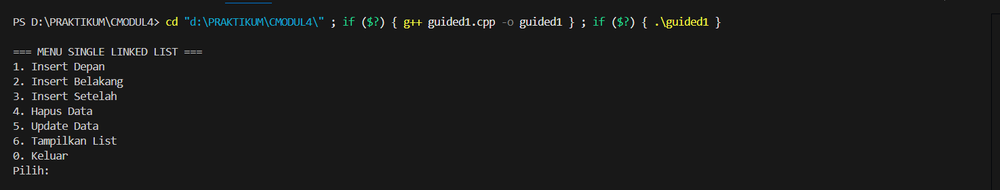
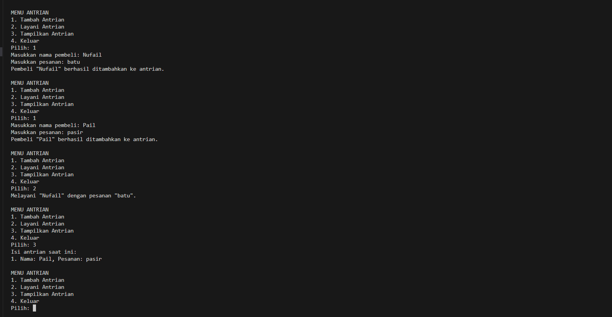
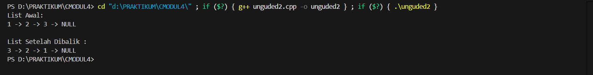

# <h1 align="center">Laporan Praktikum Modul 4 <br> SINGLY LINKED LIST (BAGIAN PERTAMA)</h1>
<p align="center">NUFAIL ALAUDDIN TSAQIF - 103112400084</p>

## Dasar Teori
Singly linked list adalah salah satu bentuk struktur data linear yang fundamental, terdiri dari kumpulan elemen yang disebut simpul (node). Setiap node terbagi menjadi dua bagian utama: satu bagian untuk menyimpan data itu sendiri, dan bagian lainnya adalah sebuah pointer (atau penunjuk) yang berisi alamat dari node berikutnya dalam urutan. Karena setiap node hanya memiliki satu pointer yang menunjuk ke node selanjutnya, maka penelusuran (traversal) data pada singly linked list hanya dapat dilakukan dalam satu arah (unidirectional), yaitu dari depan ke belakang. Untuk mengakses list, digunakan sebuah pointer khusus yang disebut head yang selalu menunjuk pada node pertama. Rangkaian ini berakhir ketika sebuah node memiliki pointer yang menunjuk ke NULL, yang menandakan akhir dari list. Sifatnya yang dinamis memungkinkan jumlah elemen dalam list untuk bertambah atau berkurang selama program berjalan, menjadikannya lebih fleksibel dibandingkan dengan struktur data statis seperti array.

## Guided

### Guided 1
```c++
#include <iostream>
using namespace std;

// Struktur Node
struct Node {
    int data;
    Node* next;
};

// Pointer awal dan akhir
Node* head = nullptr;

// Fungsi untuk membuat node baru
Node* createNode(int data) {
    Node* newNode = new Node();
    newNode->data = data;
    newNode->next = nullptr;
    return newNode;
}

void insertDepan(int data) {
    Node* newNode = createNode(data);
    newNode->next = head;
    head = newNode;
    cout << "Data " << data << " berhasil ditambahkan di depan.\n";
}

void insertBelakang(int data) {
    Node* newNode = createNode(data);
    if (head == nullptr) {
        head = newNode;
    } else {
        Node* temp = head;
        while (temp->next != nullptr) {
            temp = temp->next;
        }
        temp->next = newNode;
    }
    cout << "Data " << data << " berhasil ditambahkan di belakang.\n";
}

void insertSetelah(int target, int dataBaru) {
    Node* temp = head;
    while (temp != nullptr && temp->data != target) {
        temp = temp->next;
    }

    if (temp == nullptr) {
        cout << "Data " << target << " tidak ditemukan!\n";
    } else {
        Node* newNode = createNode(dataBaru);
        newNode->next = temp->next;
        temp->next = newNode;
        cout << "Data " << dataBaru << " berhasil disisipkan setelah " << target << ".\n";
    }
}

// ========== DELETE FUNCTION ==========
void hapusNode(int data) {
    if (head == nullptr) {
        cout << "List kosong!\n";
        return;
    }

    Node* temp = head;
    Node* prev = nullptr;

    // Jika data di node pertama
    if (temp != nullptr && temp->data == data) {
        head = temp->next;
        delete temp;
        cout << "Data " << data << " berhasil dihapus.\n";
        return;
    }

    // Cari node yang akan dihapus
    while (temp != nullptr && temp->data != data) {
        prev = temp;
        temp = temp->next;
    }

    // Jika data tidak ditemukan
    if (temp == nullptr) {
        cout << "Data " << data << " tidak ditemukan!\n";
        return;
    }

    prev->next = temp->next;
    delete temp;
    cout << "Data " << data << " berhasil dihapus.\n";
}

// ========== UPDATE FUNCTION ==========
void updateNode(int dataLama, int dataBaru) {
    Node* temp = head;
    while (temp != nullptr && temp->data != dataLama) {
        temp = temp->next;
    }

    if (temp == nullptr) {
        cout << "Data " << dataLama << " tidak ditemukan!\n";
    } else {
        temp->data = dataBaru;
        cout << "Data " << dataLama << " berhasil diupdate menjadi " << dataBaru << ".\n";
    }
}

// ========== DISPLAY FUNCTION ==========
void tampilkanList() {
    if (head == nullptr) {
        cout << "List kosong!\n";
        return;
    }

    Node* temp = head;
    cout << "Isi Linked List: ";
    while (temp != nullptr) {
        cout << temp->data << " -> ";
        temp = temp->next;
    }
    cout << "NULL\n";
}

// ========== MAIN PROGRAM ==========
int main() {
    int pilihan, data, target, dataBaru;

    do {
        cout << "\n=== MENU SINGLE LINKED LIST ===\n";
        cout << "1. Insert Depan\n";
        cout << "2. Insert Belakang\n";
        cout << "3. Insert Setelah\n";
        cout << "4. Hapus Data\n";
        cout << "5. Update Data\n";
        cout << "6. Tampilkan List\n";
        cout << "0. Keluar\n";
        cout << "Pilih: ";
        cin >> pilihan;

        switch (pilihan) {
            case 1:
                cout << "Masukkan data: ";
                cin >> data;
                insertDepan(data);
                break;
            case 2:
                cout << "Masukkan data: ";
                cin >> data;
                insertBelakang(data);
                break;
            case 3:
                cout << "Masukkan data target: ";
                cin >> target;
                cout << "Masukkan data baru: ";
                cin >> dataBaru;
                insertSetelah(target, dataBaru);
                break;
            case 4:
                cout << "Masukkan data yang ingin dihapus: ";
                cin >> data;
                hapusNode(data);
                break;
            case 5:
                cout << "Masukkan data lama: ";
                cin >> data;
                cout << "Masukkan data baru: ";
                cin >> dataBaru;
                updateNode(data, dataBaru);
                break;
            case 6:
                tampilkanList();
                break;
            case 0:
                cout << "Program selesai.\n";
                break;
            default:
                cout << "Pilihan tidak valid!\n";
        }
    } while (pilihan != 0);

    return 0;
}
```
> Output
> 
> 

Program ini adalah implementasi dari struktur data singly linked list non-circular. Program ini menyediakan antarmuka menu berbasis teks yang memungkinkan pengguna untuk melakukan operasi dasar pada linked list, seperti menambah data (di depan, di belakang, atau setelah data tertentu), menghapus data, memperbarui data, serta menampilkan seluruh isi list. Semua operasi ini dilakukan dengan memanipulasi pointer `head` dan `next` pada setiap *node* untuk menjaga integritas urutan data dalam list.

## Unguided

### Soal 1

 buatlah single linked list untuk Antrian yang menyimpan data pembeli( nama dan pesanan). program memiliki beberapa menu seperti tambah antrian,  layani antrian(hapus), dan tampilkan antrian. \*antrian pertama harus yang pertama dilayani
   
```c++
#include <iostream>
#include <string>

using namespace std;

struct Pembeli {
    string nama;
    string pesanan;
};

struct Node {
    Pembeli data;
    Node* next;
};

// Mengubah 'class' menjadi 'struct'
struct Queue {
    // Semua anggota di bawah ini sekarang bersifat public secara default
    Node* head;
    Node* tail;

    Queue() {
        head = nullptr;
        tail = nullptr;
    }

    ~Queue() {
        while (head != nullptr) {
            Node* temp = head;
            head = head->next;
            delete temp;
        }
    }

    void tambahAntrian(Pembeli data) {
        Node* newNode = new Node{data, nullptr};
        if (tail == nullptr) {
            head = tail = newNode;
        } else {
            tail->next = newNode;
            tail = newNode;
        }
        cout << "Pembeli \"" << data.nama << "\" berhasil ditambahkan ke antrian.\n";
    }

    void layaniAntrian() {
        if (head == nullptr) {
            cout << "Antrian kosong.\n";
            return;
        }
        
        Node* temp = head;
        cout << "Melayani \"" << temp->data.nama << "\" dengan pesanan \"" << temp->data.pesanan << "\".\n";
        
        head = head->next;
        if (head == nullptr) {
            tail = nullptr;
        }
        delete temp;
    }

    void tampilkanAntrian() {
        if (head == nullptr) {
            cout << "Antrian kosong!\n";
            return;
        }

        cout << "Isi antrian saat ini:\n";
        Node* temp = head;
        int nomor = 1;
        while (temp != nullptr) {
            cout << nomor << ". Nama: " << temp->data.nama << ", Pesanan: " << temp->data.pesanan << "\n";
            temp = temp->next;
            nomor++;
        }
    }
};

int main() {
    Queue antrian;
    int pilihan;
    Pembeli dataPembeli;

    while (true) {
        cout << "\nMENU ANTRIAN\n";
        cout << "1. Tambah Antrian\n";
        cout << "2. Layani Antrian\n";
        cout << "3. Tampilkan Antrian\n";
        cout << "4. Keluar\n";
        cout << "Pilih: ";
        cin >> pilihan;

        if (pilihan == 4) {
            break;
        }

        switch (pilihan) {
            case 1:
                cout << "Masukkan nama pembeli: ";
                cin.ignore();
                getline(cin, dataPembeli.nama);
                cout << "Masukkan pesanan: ";
                getline(cin, dataPembeli.pesanan);
                antrian.tambahAntrian(dataPembeli);
                break;
            case 2:
                antrian.layaniAntrian();
                break;
            case 3:
                antrian.tampilkanAntrian();
                break;
            default:
                cout << "Pilihan tidak valid.\n";
        }
    }

    return 0;
}
```

> Output
> 
> 

Program ini adalah implementasi dari sistem antrian (queue) untuk mengelola data pembeli dan pesanannya menggunakan struktur data singly linked list yang dibuat secara manual. Program ini menyediakan menu interaktif berbasis teks yang memungkinkan pengguna untuk melakukan tiga operasi dasar: menambah pembeli baru di akhir antrian (tambahAntrian), melayani pembeli pertama dalam antrian dengan menghapusnya (layaniAntrian), dan menampilkan seluruh daftar antrian saat ini. Dengan mengelola pointer head dan tail, program ini secara efektif menerapkan prinsip First-In, First-Out (FIFO), di mana pembeli yang pertama datang adalah yang pertama dilayani.

### Soal 2

buatlah program kode untuk membalik (reverse) singly linked list (1-2-3 menjadi 3-2-1) 

```c++
#include <iostream>

using namespace std;

struct Node {
    int data;
    Node* next;
};

struct LinkedList {
    Node* head;

    Node* reverseRecursive(Node* current) {
        if (current == nullptr || current->next == nullptr) {
            return current;
        }

        Node* newHead = reverseRecursive(current->next);

        current->next->next = current;
        current->next = nullptr;

        return newHead;
    }

    LinkedList() : head(nullptr) {}

    ~LinkedList() {
        Node* current = head;
        while (current != nullptr) {
            Node* nextNode = current->next;
            delete current;
            current = nextNode;
        }
    }

    void insertBelakang(int data) {
        Node* newNode = new Node{data, nullptr};
        if (!head) {
            head = newNode;
        } else {
            Node* temp = head;
            while (temp->next) temp = temp->next;
            temp->next = newNode;
        }
    }

    void tampilkan() {
        Node* temp = head;
        while (temp) {
            cout << temp->data << " -> ";
            temp = temp->next;
        }
        cout << "NULL\n";
    }

    void reverse() {
        if (head != nullptr) {
            head = reverseRecursive(head);
        }
    }
};

int main() {
    LinkedList list;

    list.insertBelakang(1);
    list.insertBelakang(2);
    list.insertBelakang(3);


    cout << "List Awal:\n";
    list.tampilkan();

    list.reverse();

    cout << "\nList Setelah Dibalik :\n";
    list.tampilkan();

    return 0;
}
```

> Output
> 
> 

Tentu, ini penjelasannya dalam satu paragraf.

Program ini mendemonstrasikan cara membalik urutan (reverse) sebuah singly linked list dengan menggunakan pendekatan rekursif. Program ini pertama-tama membangun sebuah list sederhana berisi data (1 -> 2 -> 3), menampilkannya ke layar, lalu memanggil fungsi reverseRecursive. Fungsi ini bekerja dengan cara mencapai node terakhir dari list terlebih dahulu, kemudian saat kembali melalui tumpukan panggilan (call stack), ia mengubah arah pointer next pada setiap node untuk menunjuk ke node sebelumnya, sehingga urutan list menjadi terbalik. Hasil akhir (3 -> 2 -> 1) kemudian ditampilkan untuk membuktikan bahwa proses pembalikan telah berhasil.

## Referensi

1. https://www.geeksforgeeks.org/data-structures/linked-list/ (diakses pada 9 Oktober 2025)
2. https://www.programiz.com/dsa/linked-list (diakses pada 9 Oktober 2025)
3. https://www.tutorialspoint.com/data_structures_algorithms/linked_list_algorithms.htm (diakses pada 9 Oktober 2025)
