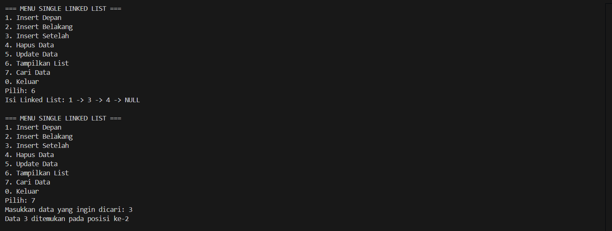
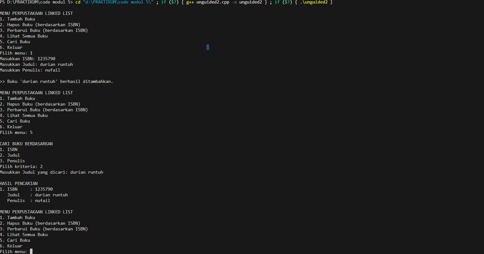

# <h1 align="center">Laporan Praktikum Modul 5 <br> SINGLY LINKED LIST (BAGIAN KEDUA)</h1>
<p align="center">MOHAMMAD REYHAN ARETHA FATIN - 103112400078</p>

## Dasar Teori
Singly Linked List adalah struktur data yang terdiri dari kumpulan elemen (struct elmlist)  yang saling terhubung menggunakan pointer. Setiap elemen memiliki dua bagian: infotype (didefinisikan sebagai int ) untuk menyimpan data, dan pointer next yang menunjuk ke elemen berikutnya. List itu sendiri memiliki penanda awal bernama first, dan list dianggap kosong jika first bernilai Nil (atau NULL). Salah satu operasi dasar yang ditekankan dalam modul adalah searching (pencarian), yang didefinisikan sebagai proses mengunjungi setiap node secara berurutan dan berhenti ketika node yang dicari telah ditemukan. Operasi pencarian ini sangat penting karena menjadi fondasi untuk mempermudah implementasi operasi lain seperti insertAfter dan deleteAfter.

Metode pencarian yang dijelaskan ini mengunjungi setiap node satu per satu dari awal secara formal dikenal sebagai Linear Search (Pencarian Linier) atau Sequential Search (Pencarian Berurutan). Keunggulan utamanya adalah kesederhanaan implementasi dan fakta bahwa data list tidak perlu diurutkan terlebih dahulu. Namun, kelemahannya terletak pada efisiensi waktu. Dalam skenario terburuk, algoritma ini harus mengunjungi seluruh $n$ elemen, sehingga memiliki kompleksitas waktu O(n).

Sebagai perbandingan, terdapat algoritma Binary Search (Pencarian Biner) yang jauh lebih efisien dengan kompleksitas waktu O(log n). Algoritma ini bekerja dengan membagi kumpulan data menjadi dua bagian secara berulang dan hanya melanjutkan pencarian di separuh bagian yang relevan. Akan tetapi, binary search memiliki syarat mutlak: data harus sudah dalam keadaan terurut (sorted) dan struktur datanya harus mendukung random access (kemampuan mengakses elemen mana pun secara langsung, seperti array). Karena singly linked list tidak mendukung random access untuk mencapai node ke-i, kita harus selalu mulai dari first maka binary search tidak dapat diimplementasikan secara efisien pada struktur data ini.

## Guided

### Guided 1
```c++
#include <iostream>
using namespace std;

// Struktur Node
struct Node {
    int data;
    Node* next;
};

// Pointer awal dan akhir
Node* head = nullptr;

// Fungsi untuk membuat node baru
Node* createNode(int data) {
    Node* newNode = new Node();
    newNode->data = data;
    newNode->next = nullptr;
    return newNode;
}

void insertDepan(int data) {
    Node* newNode = createNode(data);
    newNode->next = head;
    head = newNode;
    cout << "Data " << data << " berhasil ditambahkan di depan.\n";
}

void insertBelakang(int data) {
    Node* newNode = createNode(data);
    if (head == nullptr) {
        head = newNode;
    } else {
        Node* temp = head;
        while (temp->next != nullptr) {
            temp = temp->next;
        }
        temp->next = newNode;
    }
    cout << "Data " << data << " berhasil ditambahkan di belakang.\n";
}

void insertSetelah(int target, int dataBaru) {
    Node* temp = head;
    while (temp != nullptr && temp->data != target) {
        temp = temp->next;
    }

    if (temp == nullptr) {
        cout << "Data " << target << " tidak ditemukan!\n";
    } else {
        Node* newNode = createNode(dataBaru);
        newNode->next = temp->next;
        temp->next = newNode;
        cout << "Data " << dataBaru << " berhasil disisipkan setelah " << target << ".\n";
    }
}

// ========== DELETE FUNCTION ==========
void hapusNode(int data) {
    if (head == nullptr) {
        cout << "List kosong!\n";
        return;
    }

    Node* temp = head;
    Node* prev = nullptr;

    // Jika data di node pertama
    if (temp != nullptr && temp->data == data) {
        head = temp->next;
        delete temp;
        cout << "Data " << data << " berhasil dihapus.\n";
        return;
    }

    // Cari node yang akan dihapus
    while (temp != nullptr && temp->data != data) {
        prev = temp;
        temp = temp->next;
    }

    // Jika data tidak ditemukan
    if (temp == nullptr) {
        cout << "Data " << data << " tidak ditemukan!\n";
        return;
    }

    prev->next = temp->next;
    delete temp;
    cout << "Data " << data << " berhasil dihapus.\n";
}

// ========== UPDATE FUNCTION ==========
void updateNode(int dataLama, int dataBaru) {
    Node* temp = head;
    while (temp != nullptr && temp->data != dataLama) {
        temp = temp->next;
    }

    if (temp == nullptr) {
        cout << "Data " << dataLama << " tidak ditemukan!\n";
    } else {
        temp->data = dataBaru;
        cout << "Data " << dataLama << " berhasil diupdate menjadi " << dataBaru << ".\n";
    }
}

// ========== DISPLAY FUNCTION ==========
void tampilkanList() {
    if (head == nullptr) {
        cout << "List kosong!\n";
        return;
    }

    Node* temp = head;
    cout << "Isi Linked List: ";
    while (temp != nullptr) {
        cout << temp->data << " -> ";
        temp = temp->next;
    }
    cout << "NULL\n";
}

void searchData(int key) {
    Node* temp = head;
    int pos = 1;
    bool found = false;

    if (head == nullptr) {
        cout << "List kosong! Tidak ada data yang bisa dicari.\n";
        return;
    }

    while (temp != nullptr) {
        if (temp->data == key) {
            cout << "Data " << key << " ditemukan pada posisi ke-" << pos << endl;
            found = true;
            break;
        }
        temp = temp->next;
        pos++;
    }

    if (!found) {
        cout << "Data " << key << " tidak ditemukan dalam list.\n";
    }
}

// ========== MAIN PROGRAM ==========
int main() {
    int pilihan, data, target, dataBaru;

    do {
        cout << "\n=== MENU SINGLE LINKED LIST ===\n";
        cout << "1. Insert Depan\n";
        cout << "2. Insert Belakang\n";
        cout << "3. Insert Setelah\n";
        cout << "4. Hapus Data\n";
        cout << "5. Update Data\n";
        cout << "6. Tampilkan List\n";
        cout << "7. Cari Data\n";
        cout << "0. Keluar\n";
        cout << "Pilih: ";
        cin >> pilihan;

        switch (pilihan) {
            case 1:
                cout << "Masukkan data: ";
                cin >> data;
                insertDepan(data);
                break;
            case 2:
                cout << "Masukkan data: ";
                cin >> data;
                insertBelakang(data);
                break;
            case 3:
                cout << "Masukkan data target: ";
                cin >> target;
                cout << "Masukkan data baru: ";
                cin >> dataBaru;
                insertSetelah(target, dataBaru);
                break;
            case 4:
                cout << "Masukkan data yang ingin dihapus: ";
                cin >> data;
                hapusNode(data);
                break;
            case 5:
                cout << "Masukkan data lama: ";
                cin >> data;
                cout << "Masukkan data baru: ";
                cin >> dataBaru;
                updateNode(data, dataBaru);
                break;
            case 6:
                tampilkanList();
                break;
            case 7:
                cout << "Masukkan data yang ingin dicari: ";
                cin >> data;
                searchData(data);
                break;
            case 0:
                cout << "Program selesai. Sampai jumpa! 👋\n";
                break;
            default:
                cout << "Pilihan tidak valid!\n";
        }
    } while (pilihan != 0);

    return 0;
}
```

> Output
> 
> 

Bagian pencarian data pada program ini, yang diimplementasikan dalam fungsi searchData, menggunakan algoritma pencarian linear (linear search). Fungsi ini bekerja dengan cara menelusuri (traversing) linked list mulai dari node pertama (head). Ia menggunakan sebuah pointer temporer untuk bergerak dari satu node ke node berikutnya dan sebuah variabel counter (pos) untuk menghitung posisi (dimulai dari 1). Pada setiap node, program akan membandingkan data di dalam node tersebut dengan key (nilai yang dicari). Jika data ditemukan, program akan mencetak pesan yang menunjukkan posisi data tersebut dan menghentikan pencarian. Jika program selesai menelusuri seluruh list (mencapai NULL) tanpa menemukan data, ia akan menampilkan pesan bahwa data tidak ditemukan.

### Soal 1

buatlah searcing untuk mencari nama pembeli pada unguided sebelumnya

```c++
#include <iostream>
#include <string>

using namespace std;

struct Pembeli {
    string nama;
    string pesanan;
};

struct Node {
    Pembeli data;
    Node* next;
};

struct Queue {
    Node* head;
    Node* tail;

    Queue() {
        head = nullptr;
        tail = nullptr;
    }

    ~Queue() {
        while (head != nullptr) {
            Node* temp = head;
            head = head->next;
            delete temp;
        }
    }

    void tambahAntrian(Pembeli data) {
        Node* newNode = new Node{data, nullptr};
        if (tail == nullptr) {
            head = tail = newNode;
        } else {
            tail->next = newNode;
            tail = newNode;
        }
        cout << "Pembeli \"" << data.nama << "\" berhasil ditambahkan ke antrian.\n";
    }

    void layaniAntrian() {
        if (head == nullptr) {
            cout << "Antrian kosong.\n";
            return;
        }
        
        Node* temp = head;
        cout << "Melayani \"" << temp->data.nama << "\" dengan pesanan \"" << temp->data.pesanan << "\".\n";
        
        head = head->next;
        if (head == nullptr) {
            tail = nullptr;
        }
        delete temp;
    }

    void tampilkanAntrian() {
        if (head == nullptr) {
            cout << "Antrian kosong!\n";
            return;
        }

        cout << "Isi antrian saat ini:\n";
        Node* temp = head;
        int nomor = 1;
        while (temp != nullptr) {
            cout << nomor << ". Nama: " << temp->data.nama << ", Pesanan: " << temp->data.pesanan << "\n";
            temp = temp->next;
            nomor++;
        }
    }

    void cariPembeli(string namaCari) {
        if (head == nullptr) {
            cout << "Antrian kosong!\n";
            return;
        }

        Node* temp = head;
        int posisi = 1;
        bool ditemukan = false; 

        while (temp != nullptr) {
            if (temp->data.nama == namaCari) {
                cout << "Ditemukan: \"" << temp->data.nama 
                     << "\" di posisi " << posisi 
                     << " dengan pesanan \"" << temp->data.pesanan << "\".\n";
                ditemukan = true;
            }
            temp = temp->next; 
            posisi++;          
        }

        if (!ditemukan) {
            cout << "Pembeli \"" << namaCari << "\" tidak ditemukan di antrian.\n";
        }
    }
};

int main() {
    Queue antrian;
    int pilihan;
    
    while (true) {
        cout << "\nMENU ANTRIAN\n";
        cout << "1. Tambah Antrian\n";
        cout << "2. Layani Antrian\n";
        cout << "3. Tampilkan Antrian\n";
        cout << "4. Cari Pembeli\n";   
        cout << "5. Keluar\n";         
        cout << "Pilih: ";
        cin >> pilihan;

        if (pilihan == 5) { 
            break;
        }

        switch (pilihan) {
            case 1:
            {
                Pembeli dataPembeli; 
                cout << "Masukkan nama pembeli: ";
                cin.ignore(); 
                getline(cin, dataPembeli.nama);
                cout << "Masukkan pesanan: ";
                getline(cin, dataPembeli.pesanan);
                antrian.tambahAntrian(dataPembeli);
                break;
            }
            case 2:
                antrian.layaniAntrian();
                break;
            case 3:
                antrian.tampilkanAntrian();
                break;
            case 4: 
            {
                string namaCari;
                cout << "Masukkan nama pembeli yang dicari: ";
                cin.ignore(); 
                getline(cin, namaCari);
                antrian.cariPembeli(namaCari);
                break;
            }
            default:
                cout << "Pilihan tidak valid.\n";
        }
    }

    return 0;
}

```

> Output
> 
> 

Bagian pencarian pada program ini, yang diimplementasikan dalam fungsi cariPembeli, menggunakan algoritma pencarian linear (linear search). Fungsi ini bekerja dengan cara menelusuri (traversing) seluruh antrian dari head (paling depan) sampai ke akhir. Ia menggunakan sebuah pointer temporer untuk bergerak dari satu node ke node berikutnya dan sebuah variabel counter (posisi) untuk menghitung posisi antrian, dimulai dari 1. Pada setiap node, program akan membandingkan nama pembeli di node tersebut dengan nama yang dicari (namaCari). Keunikan dari fungsi ini adalah ia tidak berhenti setelah menemukan kecocokan pertama; ia akan terus mencari hingga akhir antrian. Hal ini memungkinkan program untuk menemukan dan menampilkan semua pembeli yang mungkin memiliki nama yang sama, lengkap dengan posisi antrian dan detail pesanan mereka. Jika setelah menelusuri seluruh antrian tidak ada satupun nama yang cocok, program akan menampilkan pesan bahwa pembeli tidak ditemukan.

### Soal 2
gunakan latihan pada pertemuan minggun ini dan tambahkan seardhing untuk mencari buku berdasarkan judul, penulis, dan ISBN

```c++
#include <iostream>
#include <string>

using namespace std;

struct Buku {
    string isbn;
    string judul;
    string penulis;
};

struct Node {
    Buku data;
    Node* next;
};

Node* head = nullptr;

void tambahBuku();
void hapusBuku();
void perbaruiBuku();
void lihatBuku();
void cariBuku();
void bersihkanMemori();

int main() {
    int pilihan;

    do {
        cout << "\nMENU PERPUSTAKAAN LINKED LIST\n";
        cout << "1. Tambah Buku\n";
        cout << "2. Hapus Buku (berdasarkan ISBN)\n";
        cout << "3. Perbarui Buku (berdasarkan ISBN)\n";
        cout << "4. Lihat Semua Buku\n";
        cout << "5. Cari Buku\n";
        cout << "6. Keluar\n";
        cout << "Pilih menu: ";
        cin >> pilihan;
        cin.ignore(); 

        switch (pilihan) {
            case 1:
                tambahBuku();
                break;
            case 2:
                hapusBuku();
                break;
            case 3:
                perbaruiBuku();
                break;
            case 4:
                lihatBuku();
                break;
            case 5:
                cariBuku();
                break;
            case 6:
                cout << "Membersihkan memori dan keluar...\n";
                break;
            default:
                cout << "Pilihan tidak valid. Silakan coba lagi.\n";
        }
    } while (pilihan != 6);

    bersihkanMemori(); 
    return 0;
}

void tambahBuku() {
    Buku bukuBaru;
    cout << "Masukkan ISBN: ";
    getline(cin, bukuBaru.isbn);
    cout << "Masukkan Judul: ";
    getline(cin, bukuBaru.judul);
    cout << "Masukkan Penulis: ";
    getline(cin, bukuBaru.penulis);

    Node* newNode = new Node{bukuBaru, nullptr};

    if (head == nullptr) {
        head = newNode;
    } else {
        Node* temp = head;
        while (temp->next != nullptr) {
            temp = temp->next;
        }
        temp->next = newNode;
    }
    cout << "\n>> Buku '" << bukuBaru.judul << "' berhasil ditambahkan." << endl;
}

void lihatBuku() {
    if (head == nullptr) {
        cout << "\n>> Perpustakaan kosong." << endl;
        return;
    }

    cout << "\nDAFTAR SEMUA BUKU\n";
    Node* temp = head;
    int nomor = 1;
    while (temp != nullptr) {
        cout << nomor << ". ISBN     : " << temp->data.isbn << endl;
        cout << "   Judul    : " << temp->data.judul << endl;
        cout << "   Penulis  : " << temp->data.penulis << endl;
        temp = temp->next;
        nomor++;
    }
}

void perbaruiBuku() {
    if (head == nullptr) {
        cout << "\n>> Perpustakaan kosong." << endl;
        return;
    }

    string isbnCari;
    cout << "Masukkan ISBN buku yang ingin diperbarui: ";
    getline(cin, isbnCari);

    Node* temp = head;
    while (temp != nullptr) {
        if (temp->data.isbn == isbnCari) {
            cout << "Buku ditemukan! Masukkan data baru:\n";
            cout << "Masukkan Judul Baru: ";
            getline(cin, temp->data.judul);
            cout << "Masukkan Penulis Baru: ";
            getline(cin, temp->data.penulis);
            cout << "\n>> Data buku berhasil diperbarui." << endl;
            return;
        }
        temp = temp->next;
    }
    cout << "\n>> Buku dengan ISBN " << isbnCari << " tidak ditemukan." << endl;
}

void hapusBuku() {
    if (head == nullptr) {
        cout << "\n>> Perpustakaan kosong." << endl;
        return;
    }
    
    string isbnCari;
    cout << "Masukkan ISBN buku yang akan dihapus: ";
    getline(cin, isbnCari);

    Node* temp = head;
    Node* prev = nullptr;

    if (temp != nullptr && temp->data.isbn == isbnCari) {
        head = temp->next;
        delete temp;
        cout << "\n>> Buku berhasil dihapus." << endl;
        return;
    }

    while (temp != nullptr && temp->data.isbn != isbnCari) {
        prev = temp;
        temp = temp->next;
    }

    if (temp == nullptr) {
        cout << "\n>> Buku dengan ISBN " << isbnCari << " tidak ditemukan." << endl;
        return;
    }

    prev->next = temp->next;
    delete temp;
    cout << "\n>> Buku berhasil dihapus." << endl;
}

void cariBuku() {
    if (head == nullptr) {
        cout << "\n>> Perpustakaan kosong. Tidak bisa mencari." << endl;
        return;
    }

    int pilihanCari;
    cout << "\nCARI BUKU BERDASARKAN\n";
    cout << "1. ISBN\n";
    cout << "2. Judul\n";
    cout << "3. Penulis\n";
    cout << "Pilih kriteria: ";
    cin >> pilihanCari;
    cin.ignore(); 

    string searchTerm;
    switch (pilihanCari) {
        case 1:
            cout << "Masukkan ISBN yang dicari: ";
            getline(cin, searchTerm);
            break;
        case 2:
            cout << "Masukkan Judul yang dicari: ";
            getline(cin, searchTerm);
            break;
        case 3:
            cout << "Masukkan Penulis yang dicari: ";
            getline(cin, searchTerm);
            break;
        default:
            cout << "Pilihan tidak valid.\n";
            return;
    }

    Node* temp = head;
    bool ditemukan = false;
    int nomor = 1;

    cout << "\nHASIL PENCARIAN\n";
    while (temp != nullptr) {
        bool match = false;
        if (pilihanCari == 1 && temp->data.isbn == searchTerm) {
            match = true;
        } else if (pilihanCari == 2 && temp->data.judul == searchTerm) {
            match = true;
        } else if (pilihanCari == 3 && temp->data.penulis == searchTerm) {
            match = true;
        }

        if (match) {
            cout << nomor << ". ISBN     : " << temp->data.isbn << endl;
            cout << "   Judul    : " << temp->data.judul << endl;
            cout << "   Penulis  : " << temp->data.penulis << endl;
            ditemukan = true;
            nomor++;
        }
        temp = temp->next;
    }

    if (!ditemukan) {
        cout << ">> Buku tidak ditemukan." << endl;
    }
}

void bersihkanMemori() {
    Node* current = head;
    while (current != nullptr) {
        Node* nextNode = current->next;
        delete current;
        current = nextNode;
    }
    head = nullptr; 
}

```

> Output
> 
> 

Fungsi pencarian (cariBuku) pada program ini menerapkan algoritma pencarian linear (linear search) yang fleksibel. Pertama, program ini mengizinkan pengguna untuk memilih kriteria pencarian: berdasarkan ISBN, Judul, atau Penulis. Setelah pengguna memasukkan kata kunci pencarian (searchTerm), fungsi akan menelusuri (traversing) keseluruhan linked list satu per satu, mulai dari head. Pada setiap node, ia akan membandingkan data buku dengan kata kunci tersebut. Program ini dirancang untuk menemukan dan menampilkan semua data buku yang cocok, sehingga ia tidak berhenti setelah temuan pertama dan akan terus mencari hingga akhir list. Jika tidak ada satupun data yang cocok ditemukan setelah seluruh list diperiksa, program akan menampilkan pesan bahwa buku tidak ditemukan.

## Referensi

1. https://www.kodingakademi.id/mengenal-linear-search-algoritma-pencarian-dasar/ (diakses pada 18 Oktober 2025)
2. https://daismabali.medium.com/metode-searching-dalam-struktur-data-dan-implementasi-pemrogramannya-d97582084866 (diakses pada 18 Oktober 2025)
3. https://www.kodingakademi.id/pengenalan-searching-dalam-c/ (diakses pada 18 Oktober 2025)
