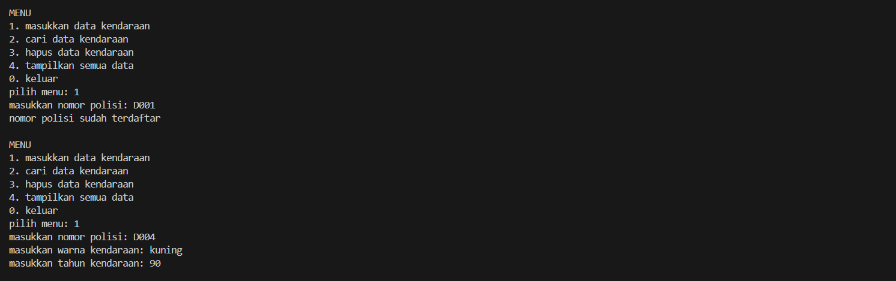
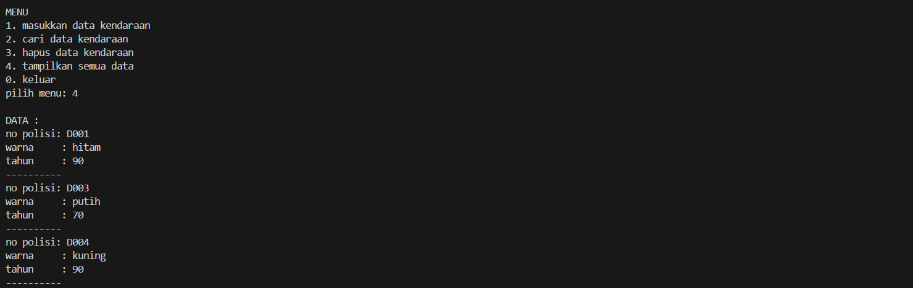

# <h1 align="center">Laporan Praktikum Modul 6 <br> DOUBLY LINKED LIST (BAGIAN PERTAMA)</h1>
<p align="center"> NUFAIL ALAUDDIN TSAQIF - 103112400084</p>

## Dasar Teori
Struktur data adalah metode khusus untuk menyimpan dan mengatur data dalam komputer sehingga dapat digunakan secara efisien, yang sangat penting untuk mengelola data dalam jumlah besar. Salah satu struktur data linear yang fundamental dan dinamis adalah Linked List (Senarai Berantai). Berbeda dengan Array yang menyimpan elemen secara berdekatan di memori, linked list terdiri dari kumpulan node, di mana setiap node menyimpan data dan sebuah pointer (penunjuk) ke alamat memori node berikutnya. Node terakhir akan menunjuk ke NULL, menandakan akhir dari list.

Doubly Linked List (DLL) adalah pengembangan dari Singly Linked List (SLL). Perbedaannya, setiap node pada DLL memiliki tiga bagian: data (info), pointer next yang menunjuk ke node berikutnya, dan pointer prev yang menunjuk ke node sebelumnya. Struktur ini dikelola oleh dua pointer utama, First (Head) dan Last (Tail). Pointer prev pada node pertama dan pointer next pada node terakhir akan menunjuk ke NULL. Keunggulan utama DLL adalah kemampuannya untuk melakukan traversal dua arah (bidirectional traversal), yaitu penelusuran dari depan ke belakang (mengikuti next) dan dari belakang ke depan (mengikuti prev).

Operasi seperti insertion (penyisipan) dan deletion (penghapusan) pada DLL mengharuskan pengaturan ulang pointer prev dan next pada node-node yang terlibat untuk menjaga integritas list. Dibandingkan SLL, kelebihan DLL adalah kemampuan traversal dua arah dan proses penghapusan yang lebih efisien (terutama deleteLast yang menjadi $O(1)$), karena kita dapat dengan mudah menemukan node sebelumnya melalui pointer prev. Namun, kekurangannya adalah kebutuhan memori yang lebih besar untuk menyimpan pointer prev di setiap node dan implementasi operasi yang sedikit lebih kompleks karena lebih banyak pointer yang harus dikelola.

## Guided

### Guided 1
```c++
#include <iostream>
using namespace std;

struct Node {
    int data;
    Node* prev;
    Node* next;
};

Node* head = nullptr;
Node* tail = nullptr;

void insertDepan(int data) {
    Node* newNode = new Node();
    newNode->data = data;
    newNode->prev = nullptr;
    newNode->next = head;

    if (head != nullptr)
        head->prev = newNode;
    else
        tail = newNode;

    head = newNode;
    cout << "Data " << data << " berhasil ditambahkan di depan.\n";
}

void insertBelakang(int data) {
    Node* newNode = new Node();
    newNode->data = data;
    newNode->next = nullptr;
    newNode->prev = tail;

    if (tail != nullptr)
        tail->next = newNode;
    else
        head = newNode;

    tail = newNode;
    cout << "Data " << data << " berhasil ditambahkan di belakang.\n";
}

void insertSetelah(int target, int data) {
    Node* current = head;
    while (current != nullptr && current->data != target)
        current = current->next;
    
    if (current == nullptr) {
        cout << "Data " << target << " tidak ditemukan.\n";
        return;
    }

    Node* newNode = new Node();
    newNode->data = data;
    newNode->next = current->next;
    newNode->prev = current;

    if (current->next != nullptr)
        current->next->prev = newNode;
    else
        tail = newNode;

    current->next = newNode;
    cout << "Data " << data << " berhasil disisipkan setelah " << target << ".\n";
}

void hapusDepan() {
    if (head == nullptr) {
        cout << "List kosong.\n";
        return;
    }

    Node* temp = head;
    head = head->next;

    if (head != nullptr)
        head->prev = nullptr;
    else
        tail = nullptr;

    cout << "Data " << temp->data << " dihapus dari depan.\n";
    delete temp;
}

void hapusBelakang() {
    if (tail = nullptr) {
        cout << "List kosong.\n";
        return;
    }

    Node* temp = tail;
    tail = tail->prev;

    if (tail != nullptr)
        tail->next = nullptr;
    else
        head = nullptr;

    cout << "Data " << temp->data << " dihapus dari belakang.\n";
    delete temp;
}

void hapusData(int target) {
    if (head == nullptr) {
        cout << "List kosong.\n";
        return;
    }

    Node* current = head;
    while (current != nullptr && current->data != target)
        current = current->next;

    if (current == head)
        hapusDepan();
    else if (current == tail)
        hapusBelakang();
    else {
        current->prev->next = current->next;
        current->next->prev = current->prev;
        cout << "Data " << target << " dihapus.\n";
        delete current;
    }
}

void updateData(int oldData, int newData) {
    Node* current = head;
    while (current != nullptr && current->data != oldData)
        current = current->next;

    if (current == nullptr) {
        cout << "Data " << oldData << " tidak ditemukan.\n";
        return;
    }

    current->data = newData;
    cout << "Data " << oldData << " diubah menjadi " << newData << ".\n";
}

void tampilDepan() {
    if (head == nullptr) {
        cout << "List kosong.\n";
        return;
    }

    cout << "Isi list (dari depan): ";
    Node* current = head;
    while (current != nullptr) {
        cout << current->data << " ";
        current = current->next;
    }
    cout << "\n";
}

// ====================================
// Fungsi: Tampilkan dari belakang
// ====================================
void tampilBelakang() {
    if (tail == nullptr) {
        cout << "List kosong.\n";
        return;
    }

    cout << "Isi list (dari belakang): ";
    Node* current = tail;
    while (current != nullptr) {
        cout << current->data << " ";
        current = current->prev;
    }
    cout << "\n";
}

// ====================================
// MAIN PROGRAM (MENU INTERAKTIF)
// ====================================
int main() {
    int pilihan, data, target, oldData, newData;

    do {
        cout << "\n===== MENU DOUBLE LINKED LIST =====\n";
        cout << "1. Insert Depan\n";
        cout << "2. Insert Belakang\n";
        cout << "3. Insert Setelah Data\n";
        cout << "4. Hapus Depan\n";
        cout << "5. Hapus Belakang\n";
        cout << "6. Hapus Data Tertentu\n";
        cout << "7. Update Data\n";
        cout << "8. Tampil dari Depan\n";
        cout << "9. Tampil dari Belakang\n";
        cout << "0. Keluar\n";
        cout << "===================================\n";
        cout << "Pilih menu: ";
        cin >> pilihan;

        switch (pilihan) {
            case 1:
                cout << "Masukkan data: ";
                cin >> data;
                insertDepan(data);
                break;
            case 2:
                cout << "Masukkan data: ";
                cin >> data;
                insertBelakang(data);
                break;
            case 3:
                cout << "Masukkan data target: ";
                cin >> target;
                cout << "Masukkan data baru: ";
                cin >> data;
                insertSetelah(target, data);
                break;
            case 4:
                hapusDepan();
                break;
            case 5:
                hapusBelakang();
                break;
            case 6:
                cout << "Masukkan data yang ingin dihapus: ";
                cin >> target;
                hapusData(target);
                break;
            case 7:
                cout << "Masukkan data lama: ";
                cin >> oldData;
                cout << "Masukkan data baru: ";
                cin >> newData;
                updateData(oldData, newData);
                break;
            case 8:
                tampilDepan();
                break;
            case 9:
                tampilBelakang();
                break;
            case 0:
                cout << "👋 Keluar dari program.\n";
                break;
            default:
                cout << "Pilihan tidak valid.\n";
        }

    } while (pilihan != 0);

    return 0;
}
```

> Output
> 
> 

Program ini adalah implementasi doubly linked list C++ yang lengkap, dikendalikan oleh sebuah menu interaktif yang menggunakan pointer global head dan tail. Program ini menyediakan fungsionalitas CRUD penuh, memungkinkan pengguna untuk menambah data (di depan, belakang, atau setelah data lain), menghapus data (dari depan, belakang, atau data spesifik), serta meng-update nilai data yang ada. Keunggulan utamanya ditunjukkan melalui kemampuan untuk menampilkan seluruh isi list dari dua arah, baik secara maju (dari head ke tail) maupun mundur (dari tail ke head), yang semuanya diatur dalam sebuah loop do-while hingga pengguna memilih untuk keluar.

## UNGUIDED

### Soal 1

Buatlah ADT Doubly Linked list sebagai berikut di dalam file “Doublylist.h”:
```c++
Type infotype : kendaraan <
 nopol : string
 warna : string
 thnBuat : integer
>
Type address : pointer to ElmList
Type ElmList <
 info : infotype
 next :address
 prev : address
>
Type List <
 First : address
 Last : address
>
procedure CreateList( input/output L : List )
function alokasi( x : infotype ) → address
procedure dealokasi(input/output P : address )
procedure printInfo( input L : List )
procedure insertLast(input/output L : List,
 input P : address )

```
Buatlah implementasi ADT Doubly Linked list pada file “Doublylist.cpp” dan coba hasil
implementasi ADT pada file “main.cpp”.

### Soal 2
Carilah elemen dengan nomor polisi D001 dengan membuat fungsi baru.
fungsi findElm( L : List, x : infotype ) : address

### Soal 3
Hapus elemen dengan nomor polisi D003 dengan procedure delete.
- procedure deleteFirst( input/output L : List,
 P : address )
- procedure deleteLast( input/output L : List,
 P : address )
- procedure deleteAfter( input Prec : address,
 input/output P : address )

### JAWABAN NOMOR 1,2,3

#### doublylist.h
```c++
#ifndef DOUBLYLIST_H
#define DOUBLYLIST_H

#include <iostream>
#include <string>

using namespace std;

#define Nil NULL

struct infotype {
    string nopol;
    string warna;
    int thnBuat;
};

typedef struct elmlist *address;
struct elmlist {
    infotype info;
    address next;
    address prev;
};

struct list {
    address First;
    address Last;
};

void CreateList(list &L);
address alokasi(infotype x);
void dealokasi(address &P);
void printInfo(list L);

void insertLast(list &L, address P);

address findElm(list L, string nopol);

void deleteFirst(list &L, address &P);
void deleteLast(list &L, address &P);
void deleteAfter(list &L, address Prec, address &P);

#endif
```
#### doublylist.cpp
```c++
#include "Doublylist.h"
#include <iostream>
#include <string>

using namespace std;

void hapusKendaraan(list& L, string target) {
    address P = findElm(L, target);
    
    
    if (P == Nil) { 
        cout << "data dengan nomor polisi " << target << " tidak ditemukan" << endl;
        return;
    }

    
    if (P == L.First && P == L.Last) {
        L.First = Nil;
        L.Last = Nil;
    } 
    
    else if (P == L.First) {
        L.First = P->next;
        L.First->prev = Nil;
    } 
    
    else if (P == L.Last) {
        L.Last = P->prev;
        L.Last->next = Nil;
    } 
    
    else {
        P->prev->next = P->next;
        P->next->prev = P->prev;
    }
    
    cout << "data dengan nomor polisi " << target << " berhasil dihapus" << endl;
    
    
    P->next = Nil;
    P->prev = Nil;
    dealokasi(P); 
}

int main() {
    list L; 
    CreateList(L); 
    address P;
    infotype data;
    string target;
    int pilihan;

    do {
        cout << "\nMENU\n";
        cout << "1. masukkan data kendaraan\n";
        cout << "2. cari data kendaraan\n";
        cout << "3. hapus data kendaraan\n";
        cout << "4. tampilkan semua data\n";
        cout << "0. keluar\n";
        cout << "pilih menu: ";
        cin >> pilihan;
        cin.ignore(); 

        switch (pilihan) {
            case 1:
                cout << "masukkan nomor polisi: ";
                getline(cin, data.nopol);
                if (findElm(L, data.nopol) != Nil) { 
                    cout << "nomor polisi sudah terdaftar" << endl;
                } else {
                    cout << "masukkan warna kendaraan: ";
                    getline(cin, data.warna);
                    cout << "masukkan tahun kendaraan: ";
                    cin >> data.thnBuat;
                    cin.ignore(); 
                    P = alokasi(data);
                    insertLast(L, P);
                }
                break;
            case 2:
                cout << "masukkan nomor polisi yang dicari: ";
                getline(cin, target);
                P = findElm(L, target);
                if (P != Nil) { 
                    cout << "\ndata ditemukan:" << endl;
                    cout << "nomor polisi: " << P->info.nopol << endl; 
                    cout << "warna       : " << P->info.warna << endl; 
                    cout << "tahun       : " << P->info.thnBuat << endl; 
                } else {
                    cout << "data tidak ditemukan" << endl;
                }
                break;
            case 3:
                cout << "masukkan nomor polisi yang akan dihapus: ";
                getline(cin, target);
                hapusKendaraan(L, target);
                break;
            case 4:
                cout << "\nDATA :" << endl;
                printInfo(L);
                break;
            case 0:
                cout << "tengkyuu\n";
                break;
            default:
                cout << "pilihan tidak valid\n";
        }
    } while (pilihan != 0);

    return 0;
}
```
#### main.cpp
```c++
#include "Doublylist.h"

void CreateList(list &L) {
    L.First = Nil;
    L.Last = Nil;
}

address alokasi(infotype x) {
    address P = new elmlist;
    P->info = x;
    P->next = Nil;
    P->prev = Nil;
    return P;
}

void dealokasi(address &P) {
    delete P;
}


address findElm(list L, string nopol) {
    address P = L.First;
    while (P != Nil) {
        if (P->info.nopol == nopol) {
            return P;
        }
        P = P->next;
    }
    return Nil;
}

void insertLast(list &L, address P) {
    if (L.First == Nil) {
        L.First = P;
        L.Last = P;
    } else {
        P->prev = L.Last;
        L.Last->next = P;
        L.Last = P;
    }
}

void printInfo(list L) {
    address P = L.First; 
    if (P == Nil) {
        cout << "List kosong." << endl;
        return;
    }
    
    while (P != Nil) {
        cout << "no polisi: " << P->info.nopol << endl;
        cout << "warna     : " << P->info.warna << endl;
        cout << "tahun     : " << P->info.thnBuat << endl;
        cout << "----------" << endl;
        P = P->next; 
    }
}

void deleteFirst(list &L, address &P) {
    P = L.First;
    if (L.First == Nil) {
        return;
    }
    
    if (L.First == L.Last) {
        L.First = Nil;
        L.Last = Nil;
    } else {
        L.First = P->next;
        L.First->prev = Nil;
        P->next = Nil;
    }
}

void deleteLast(list &L, address &P) {
    P = L.Last;
    if (L.First == Nil) {
        return;
    }
    
    if (L.First == L.Last) {
        L.First = Nil;
        L.Last = Nil;
    } else {
        L.Last = P->prev;
        L.Last->next = Nil;
        P->prev = Nil;
    }
}

void deleteAfter(list &L, address Prec, address &P) {
    
    if (Prec == Nil || Prec->next == Nil) {
        P = Nil;
        return;
    }
    
    if (Prec->next == L.Last) {
        deleteLast(L, P);
    } else {
        P = Prec->next;
        address Succ = P->next;
        Prec->next = Succ;
        Succ->prev = Prec;
        P->next = Nil;
        P->prev = Nil;
    }
}
```
#### OUTPUT & DEKSRIPSI PROGRAM
> Output soal 1
> 
> 
> 
> 


Porgram ini demonstrasi fungsi penambahan data dan pengecekan duplikat. Awalnya, pengguna berhasil memasukkan dua data kendaraan: "D001" (hitam, 90) dan "D003" (putih, 70). Kedua data ini dimasukkan ke akhir list. Selanjutnya, program diuji dengan mencoba memasukkan "D001" lagi. Sistem berhasil mendeteksi duplikasi ini dan menampilkan pesan "nomor polisi sudah terdaftar", sehingga data ganda tidak ditambahkan. Setelah itu, pengguna berhasil menambahkan data ketiga, "D004" (kuning, 90). Terakhir, ketika Menu 4 (tampilkan semua data) dipilih, program mencetak seluruh isi list secara berurutan dari awal hingga akhir (sesuai implementasi printInfo yang baru), yaitu D001, diikuti D003, dan terakhir D004.

> Output soal 2
> 
> 

Program ini menunjukkan cara kerja fungsi pencarian data. Pengguna memilih menu 2 dan memasukkan nomor polisi "D001" sebagai target yang ingin dicari. Program kemudian menelusuri list dari awal, berhasil menemukan data tersebut, dan segera menampilkan semua informasi yang terkait dengannya: "nomor polisi: D001", "warna: hitam", dan "tahun: 90". Ini membuktikan bahwa fungsi pencarian (findElm) bekerja dengan akurat.

> Output soal 3
> 
> 
> 
Output ketiga adalah demonstrasi dari fungsi penghapusan data. Pengguna memilih untuk menghapus data dan memasukkan nomor polisi "D003". Pada titik ini, "D003" berada di tengah list (setelah D001 dan sebelum D004). Program memanggil fungsi hapusKendaraan, yang kemudian menemukan node "D003", mengatur ulang pointer dari node D001 dan D004 untuk menyambung kembali list, dan akhirnya menghapus node D003. Program kemudian memberikan pesan konfirmasi "data dengan nomor polisi D003 berhasil dihapus".


## Referensi

1. https://www.scaler.com/topics/doubly-linked-list-cpp/ (diakses pada 24 Oktober 2025)
2. https://daismabali.medium.com/memahami-doubly-linked-list-dalam-struktu-data-dengan-mudah-e9192a3fbacd (diakses pada 24 Oktober 2025)
3. https://www.tutorialspoint.com/data_structures_algorithms/doubly_linked_list_algorithm.htm (diakses pada 24 Oktober 2025)
