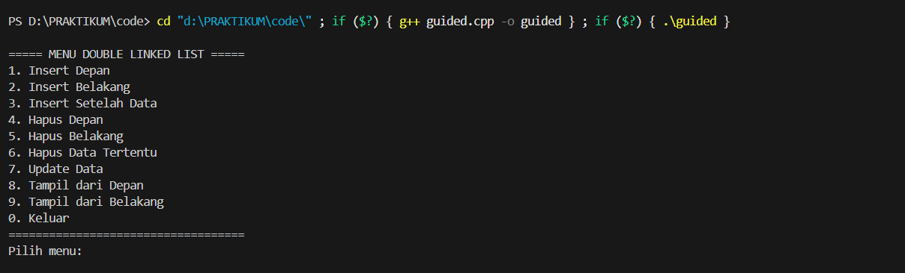
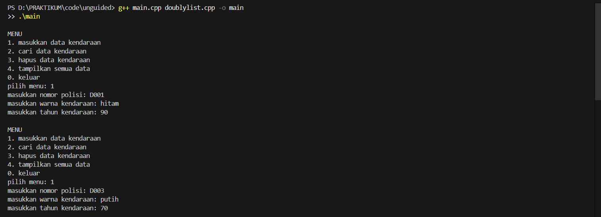
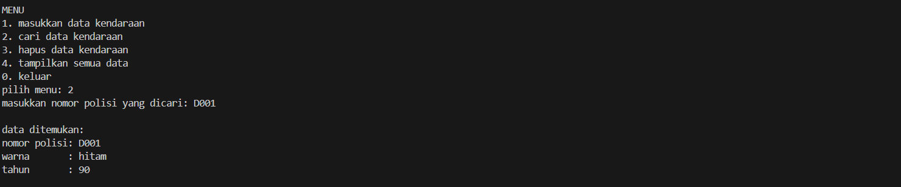

# <h1 align="center">Laporan Praktikum Modul 6 <br> DOUBLY LINKED LIST (BAGIAN PERTAMA)</h1>
<p align="center"> NUFAIL ALAUDDIN TSAQIF - 103112400084</p>

## Dasar Teori

## Guided

### Guided 1
```c++
#include <iostream>
using namespace std;

struct Node {
    int data;
    Node* prev;
    Node* next;
};

Node* head = nullptr;
Node* tail = nullptr;

void insertDepan(int data) {
    Node* newNode = new Node();
    newNode->data = data;
    newNode->prev = nullptr;
    newNode->next = head;

    if (head != nullptr)
        head->prev = newNode;
    else
        tail = newNode;

    head = newNode;
    cout << "Data " << data << " berhasil ditambahkan di depan.\n";
}

void insertBelakang(int data) {
    Node* newNode = new Node();
    newNode->data = data;
    newNode->next = nullptr;
    newNode->prev = tail;

    if (tail != nullptr)
        tail->next = newNode;
    else
        head = newNode;

    tail = newNode;
    cout << "Data " << data << " berhasil ditambahkan di belakang.\n";
}

void insertSetelah(int target, int data) {
    Node* current = head;
    while (current != nullptr && current->data != target)
        current = current->next;
    
    if (current == nullptr) {
        cout << "Data " << target << " tidak ditemukan.\n";
        return;
    }

    Node* newNode = new Node();
    newNode->data = data;
    newNode->next = current->next;
    newNode->prev = current;

    if (current->next != nullptr)
        current->next->prev = newNode;
    else
        tail = newNode;

    current->next = newNode;
    cout << "Data " << data << " berhasil disisipkan setelah " << target << ".\n";
}

void hapusDepan() {
    if (head == nullptr) {
        cout << "List kosong.\n";
        return;
    }

    Node* temp = head;
    head = head->next;

    if (head != nullptr)
        head->prev = nullptr;
    else
        tail = nullptr;

    cout << "Data " << temp->data << " dihapus dari depan.\n";
    delete temp;
}

void hapusBelakang() {
    if (tail = nullptr) {
        cout << "List kosong.\n";
        return;
    }

    Node* temp = tail;
    tail = tail->prev;

    if (tail != nullptr)
        tail->next = nullptr;
    else
        head = nullptr;

    cout << "Data " << temp->data << " dihapus dari belakang.\n";
    delete temp;
}

void hapusData(int target) {
    if (head == nullptr) {
        cout << "List kosong.\n";
        return;
    }

    Node* current = head;
    while (current != nullptr && current->data != target)
        current = current->next;

    if (current == head)
        hapusDepan();
    else if (current == tail)
        hapusBelakang();
    else {
        current->prev->next = current->next;
        current->next->prev = current->prev;
        cout << "Data " << target << " dihapus.\n";
        delete current;
    }
}

void updateData(int oldData, int newData) {
    Node* current = head;
    while (current != nullptr && current->data != oldData)
        current = current->next;

    if (current == nullptr) {
        cout << "Data " << oldData << " tidak ditemukan.\n";
        return;
    }

    current->data = newData;
    cout << "Data " << oldData << " diubah menjadi " << newData << ".\n";
}

void tampilDepan() {
    if (head == nullptr) {
        cout << "List kosong.\n";
        return;
    }

    cout << "Isi list (dari depan): ";
    Node* current = head;
    while (current != nullptr) {
        cout << current->data << " ";
        current = current->next;
    }
    cout << "\n";
}

// ====================================
// Fungsi: Tampilkan dari belakang
// ====================================
void tampilBelakang() {
    if (tail == nullptr) {
        cout << "List kosong.\n";
        return;
    }

    cout << "Isi list (dari belakang): ";
    Node* current = tail;
    while (current != nullptr) {
        cout << current->data << " ";
        current = current->prev;
    }
    cout << "\n";
}

// ====================================
// MAIN PROGRAM (MENU INTERAKTIF)
// ====================================
int main() {
    int pilihan, data, target, oldData, newData;

    do {
        cout << "\n===== MENU DOUBLE LINKED LIST =====\n";
        cout << "1. Insert Depan\n";
        cout << "2. Insert Belakang\n";
        cout << "3. Insert Setelah Data\n";
        cout << "4. Hapus Depan\n";
        cout << "5. Hapus Belakang\n";
        cout << "6. Hapus Data Tertentu\n";
        cout << "7. Update Data\n";
        cout << "8. Tampil dari Depan\n";
        cout << "9. Tampil dari Belakang\n";
        cout << "0. Keluar\n";
        cout << "===================================\n";
        cout << "Pilih menu: ";
        cin >> pilihan;

        switch (pilihan) {
            case 1:
                cout << "Masukkan data: ";
                cin >> data;
                insertDepan(data);
                break;
            case 2:
                cout << "Masukkan data: ";
                cin >> data;
                insertBelakang(data);
                break;
            case 3:
                cout << "Masukkan data target: ";
                cin >> target;
                cout << "Masukkan data baru: ";
                cin >> data;
                insertSetelah(target, data);
                break;
            case 4:
                hapusDepan();
                break;
            case 5:
                hapusBelakang();
                break;
            case 6:
                cout << "Masukkan data yang ingin dihapus: ";
                cin >> target;
                hapusData(target);
                break;
            case 7:
                cout << "Masukkan data lama: ";
                cin >> oldData;
                cout << "Masukkan data baru: ";
                cin >> newData;
                updateData(oldData, newData);
                break;
            case 8:
                tampilDepan();
                break;
            case 9:
                tampilBelakang();
                break;
            case 0:
                cout << "👋 Keluar dari program.\n";
                break;
            default:
                cout << "Pilihan tidak valid.\n";
        }

    } while (pilihan != 0);

    return 0;
}
```

> Output
> 
> 


## UNGUIDED

### Soal 1

Buatlah ADT Doubly Linked list sebagai berikut di dalam file “Doublylist.h”:
```c++
Type infotype : kendaraan <
 nopol : string
 warna : string
 thnBuat : integer
>
Type address : pointer to ElmList
Type ElmList <
 info : infotype
 next :address
 prev : address
>
Type List <
 First : address
 Last : address
>
procedure CreateList( input/output L : List )
function alokasi( x : infotype ) → address
procedure dealokasi(input/output P : address )
procedure printInfo( input L : List )
procedure insertLast(input/output L : List,
 input P : address )

```
Buatlah implementasi ADT Doubly Linked list pada file “Doublylist.cpp” dan coba hasil
implementasi ADT pada file “main.cpp”.

### Soal 2
Carilah elemen dengan nomor polisi D001 dengan membuat fungsi baru.
fungsi findElm( L : List, x : infotype ) : address

### Soal 3
Hapus elemen dengan nomor polisi D003 dengan procedure delete.
- procedure deleteFirst( input/output L : List,
 P : address )
- procedure deleteLast( input/output L : List,
 P : address )
- procedure deleteAfter( input Prec : address,
 input/output P : address )

### JAWABAN NOMOR 1,2,3

#### doublylist.h
```c++
#ifndef DOUBLYLIST_H
#define DOUBLYLIST_H

#include <iostream>
#include <string>

using namespace std;

#define Nil NULL

struct infotype {
    string nopol;
    string warna;
    int thnBuat;
};

typedef struct elmlist *address;
struct elmlist {
    infotype info;
    address next;
    address prev;
};

struct list {
    address First;
    address Last;
};

void CreateList(list &L);
address alokasi(infotype x);
void dealokasi(address &P);
void printInfo(list L);

void insertLast(list &L, address P);

address findElm(list L, string nopol);

void deleteFirst(list &L, address &P);
void deleteLast(list &L, address &P);
void deleteAfter(list &L, address Prec, address &P);

#endif
```
#### doublylist.cpp
```c++

```
#### main.cpp
```c++

```
#### OUTPUT & DEKSRIPSI PROGRAM
> Output soal 1
> 
> 
> 

demonstrasi fungsi penambahan data (Menu 1) dan pengecekan duplikat. Awalnya, pengguna berhasil memasukkan dua data kendaraan: "D001" (hitam, 90) dan "D003" (putih, 70). Kedua data ini dimasukkan ke akhir list. Selanjutnya, program diuji dengan mencoba memasukkan "D001" lagi. Sistem berhasil mendeteksi duplikasi ini dan menampilkan pesan "nomor polisi sudah terdaftar", sehingga data ganda tidak ditambahkan. Setelah itu, pengguna berhasil menambahkan data ketiga, "D004" (kuning, 90). Terakhir, ketika Menu 4 (tampilkan semua data) dipilih, program mencetak seluruh isi list secara berurutan dari awal hingga akhir (sesuai implementasi printInfo yang baru), yaitu D001, diikuti D003, dan terakhir D004.

> Output soal 2
> 
> 

menunjukkan pengguna memilih menu 2, yaitu "cari data kendaraan". Program kemudian merespons dengan meminta "masukkan nomor polisi yang dicari:", dan pengguna mengetikkan D001 sebagai target pencarian. Ini memicu pemanggilan fungsi P = findElm(L, target). Fungsi findElm kemudian menelusuri list mulai dari L.First ke depan, membandingkan P->info.nopol dengan target "D001". Karena data "D001" (yang dimasukkan pada gambar unguided1.1.png) ditemukan dalam list, fungsi findElm mengembalikan address P dari node tersebut, yang berarti P tidak Nil. Akibatnya, kondisi if (P != Nil) di main.cpp terpenuhi, dan program mencetak "data ditemukan:" diikuti oleh rincian data yang tersimpan di P->info, yaitu nomor polisi D001, warna hitam, dan tahun 90.

> Output soal 3
> 
> 
> 
ini mendemonstrasikan eksekusi dari menu 3, yaitu "hapus data kendaraan". Pengguna diminta untuk memasukkan nomor polisi yang akan dihapus, dan mereka mengetikkan D004. Ini memanggil fungsi hapusKendaraan dengan target "D004". Fungsi ini pertama-tama menggunakan findElm untuk menemukan node yang berisi "D004". Berdasarkan konteks dari gambar sebelumnya, "D004" adalah data terakhir yang dimasukkan, sehingga ia adalah L.Last dalam list. Karena node ini bukan elemen pertama (L.First), fungsi hapusKendaraan mengambil node sebelumnya (precNode, yaitu "D003") dan memanggil deleteAfter(L, precNode, temp). Di dalam deleteAfter, program mendeteksi bahwa node yang akan dihapus (Prec->next) adalah L.Last, sehingga ia memanggil fungsi deleteLast(L, temp). deleteLast kemudian memperbarui L.Last untuk menunjuk ke node "D003", mengatur pointer next dari "D003" menjadi Nil, dan mengembalikan node "D004" yang telah terputus. Akhirnya, hapusKendaraan mencetak pesan sukses "data dengan nomor polisi D004 berhasil dihapus" dan memanggil dealokasi(temp) untuk membebaskan memori node tersebut.


## Referensi

1. https://www.geeksforgeeks.org/cpp/doubly-linked-list-in-cpp/ (diakses pada 23 Oktober 2025)
2. https://www.programiz.com/dsa/doubly-linked-list (diakses pada 23 Oktober 2025)
3. https://www.tutorialspoint.com/cplusplus-program-to-implement-doubly-linked-list (diakses pada 23 Oktober 2025)
