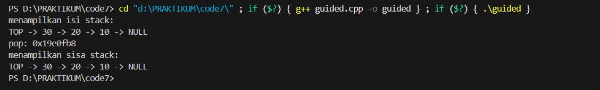
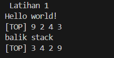
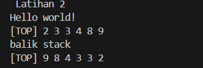
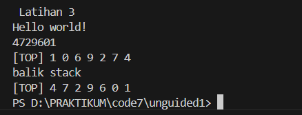

# <h1 align="center">Laporan Praktikum Modul 7 <br>STACK</h1>
<p align="center">NUFAIL ALAUDDIN TSAQIF - 103112400084</p>

## Dasar Teori
Stack (tumpukan) adalah salah satu bentuk struktur data linear yang beroperasi dengan prinsip LIFO (Last In First Out); elemen yang terakhir kali dimasukkan adalah elemen yang pertama kali akan diambil. Semua operasi, baik penyisipan maupun pengambilan, hanya dapat dilakukan pada satu ujung yang disebut "Top". Terdapat dua cara utama untuk mengimplementasikan stack: representasi pointer (linked list) dan representasi tabel (array). Pada implementasi pointer, setiap elemen (elmStack) berisi data (info) dan pointer (next) ke elemen di bawahnya , dengan stack utama hanya menyimpan pointer Top. Pada implementasi tabel, stack menggunakan array dengan ukuran terbatas, di mana sebuah indeks Top melacak posisi data teratas, dan stack dinyatakan kosong saat Top bernilai 0.

Operasi utama pada stack adalah Push dan Pop. Push adalah operasi menyisipkan elemen baru ke atas tumpukan. Pada linked list, ini bekerja seperti insert first: elemen baru menunjuk ke Top yang lama, dan Top diperbarui menjadi elemen baru. Pada array, Top dinaikkan satu (Top = Top + 1), dan data baru disisipkan pada indeks Top tersebut. Sebaliknya, Pop adalah operasi mengambil elemen teratas. Pada linked list, ini seperti delete first: Top disimpan sementara, lalu Top digeser ke elemen berikutnya ((S.Top)->next), dan elemen yang disimpan tadi dikembalikan. Pada array, data pada indeks Top diambil, lalu nilai Top diturunkan satu (TOP = TOP - 1). Primitif dasar lainnya termasuk createStack() untuk inisialisasi dan isEmpty() untuk memeriksa apakah stack kosong.

## Guided

### Guided 1

```c++
#include <iostream>
using namespace std;

struct Node
{
    int data;
    Node *next;
};

bool isEmpty(Node *top)
{
    return top == nullptr;
}

void push(Node *&top, int data)
{
    Node *newNode = new Node();
    newNode->data = data;
    newNode->next = top;
    top = newNode;
}

int pop(Node *&top)
{
    if (isEmpty(top))
    {
        cout << "Stack kosong, tidak bisa pop!" << endl;
        return 0;
    }

    int poppedData = top->data;
    Node *temp = top;
    top = top->next;
    
    delete temp;
    return poppedData;
}

void show(Node *top)
{
    if (isEmpty(top))
    {
        cout << "Stack kosong." << endl;
        return;
    }

    cout << "TOP -> ";
    Node *temp = top;

    while (temp != nullptr)
    {
        cout << temp->data << " -> ";
        temp = temp->next;
    }

    cout << "NULL" << endl;
}

int main()
{
    Node*stack = nullptr;

    push(stack, 10);
    push(stack, 20);
    push(stack, 30);
    
    cout << "menampilkan isi stack: " << endl;
    show(stack);

    cout << "pop: " <<(stack) <<endl;

    cout << "menampilkan sisa stack: " << endl;
    show(stack);

    return 0;
}
```

> Output
> 
> 

Program ini adalah implementasi stack (tumpukan) data menggunakan singly linked list dalam bahasa C++. Program ini mendefinisikan sebuah struct Node yang menyimpan data integer dan sebuah pointer next ke node berikutnya. Terdapat fungsi-fungsi dasar untuk operasi stack: push untuk menambahkan elemen baru ke atas tumpukan, pop untuk menghapus dan mengembalikan elemen teratas, isEmpty untuk memeriksa apakah tumpukan kosong, dan show untuk menampilkan seluruh isi tumpukan dari TOP hingga NULL. Pada fungsi main, program membuat stack kosong, lalu melakukan push data 10, 20, dan 30 (menghasilkan stack TOP -> 30 -> 20 -> 10 -> NULL). Namun, terdapat kesalahan pada baris pemanggilan pop: kode cout << "pop: " <<(stack) <<endl; tidak memanggil fungsi pop(stack), melainkan hanya mencetak alamat memori dari pointer stack itu sendiri (terlihat pada output Anda sebagai 0x19e0fb8). Akibatnya, tidak ada elemen yang dihapus dari stack, sehingga ketika show(stack) dipanggil untuk kedua kalinya, isinya masih utuh dan sama seperti sebelumnya.

## UNGUIDED

### Soal 1

Buatlah ADT Stack menggunakan ARRAY sebagai berikut di dalam file “stack.h”:
```c++
Type infotype : integer
Type Stack <
info : array [20] of integer
top : integer
>
procedure CreateStack( input/output S : Stack )
procedure push(input/output S : Stack,
input x : infotype)
function pop(input/output t S : Stack )
→ infotype
procedure printInfo( input S : Stack )
procedure balikStack(input/output S :
Stack )
```
Buatlah implementasi ADT Stack menggunakan Array pada file “stack.cpp” dan “main.cpp”
### Soal 2

Tambahkan prosedur pushAscending( in/out S : Stack, in x : integer)

### Soal 3

Tambahkan prosedur getInputStream( in/out S : Stack ). Prosedur akan terus membaca dan
menerima input user dan memasukkan setiap input ke dalam stack hingga user menekan
tombol enter. Contoh: gunakan cin.get() untuk mendapatkan inputan user.

### JAWABAN NOMOR 1,2,3

#### stack.h
```c++
#ifndef STACK_H
#define STACK_H

#include <iostream>
#define MAX_STACK 20 

typedef int infotype;

struct Stack {
    infotype info[MAX_STACK + 1]; 
    int top;
};
void createStack(Stack &S);
bool isEmpty(Stack S);
bool isFull(Stack S);
void push(Stack &S, infotype x);
infotype pop(Stack &S);
void printInfo(Stack S);
void balikStack(Stack &S);
void pushAscending(Stack &S, infotype x);
void getInputStream(Stack &S);

#endif
```
#### stack.cpp
```c++
#include "stack.h"
#include <iostream> 

using namespace std; 

void createStack(Stack &S) {
    S.top = 0;
}

bool isEmpty(Stack S) {
    return S.top == 0;
}
bool isFull(Stack S) {
    return S.top == MAX_STACK;
}
void push(Stack &S, infotype x) {
    if (!isFull(S)) {
        S.top++; 
        S.info[S.top] = x;
    } else {
        cout << "Stack penuh!" << endl;
    }
}
infotype pop(Stack &S) {
    if (!isEmpty(S)) {
        infotype x = S.info[S.top];
        S.top--; 
        return x;
    } else {
        cout << "Stack kosong!" << endl; 
        return -1; 
    }
}

void printInfo(Stack S) {
    cout << "[TOP] "; 
    for (int i = S.top; i >= 1; i--) {
        cout << S.info[i] << " "; 
    }
    cout << endl; 
}

void balikStack(Stack &S) {
    Stack temp1, temp2;
    createStack(temp1);
    createStack(temp2);

    while (!isEmpty(S)) {
        push(temp1, pop(S));
    }
    while (!isEmpty(temp1)) {
        push(temp2, pop(temp1));
    }
    while (!isEmpty(temp2)) {
        push(S, pop(temp2));
    }
}

void pushAscending(Stack &S, infotype x) {
    Stack temp;
    createStack(temp);
    while (!isEmpty(S) && x > S.info[S.top]) {
        push(temp, pop(S));
    }
    push(S, x);
    while (!isEmpty(temp)) {
        push(S, pop(temp));
    }
}

void getInputStream(Stack &S) {
    char c;
    c = cin.get(); 
    while (c != '\n') {
        if (c >= '0' && c <= '9') {
            push(S, c - '0');
        }
        c = cin.get(); 
    }
}
```
#### main.cpp
```c++
#include "stack.h"
#include <iostream>


using namespace std;

int main() {
    cout << " Latihan 1 " << endl;
    cout << "Hello world!" << endl; 
    Stack S1;
    createStack(S1); 
    push(S1, 3);     
    push(S1, 4);     
    push(S1, 8);     
    pop(S1);         
    push(S1, 2);     
    push(S1, 3);     
    pop(S1);         
    push(S1, 9);     
    
    printInfo(S1);   
    
    cout << "balik stack" << endl; 
    balikStack(S1);  
    printInfo(S1);   
    cout << endl; 

    
    cout << " Latihan 2 " << endl;
    cout << "Hello world!" << endl; 
    Stack S2;
    createStack(S2); 
    pushAscending(S2, 3); 
    pushAscending(S2, 4); 
    pushAscending(S2, 8); 
    pushAscending(S2, 2); 
    pushAscending(S2, 3); 
    pushAscending(S2, 9); 
    
    printInfo(S2); 
    
    cout << "balik stack" << endl; 
    balikStack(S2); 
    printInfo(S2); 
    cout << endl; 

    cout << " Latihan 3 " << endl;
    cout << "Hello world!" << endl; 
    Stack S3;
    createStack(S3); 
    
    cin.sync();
    getInputStream(S3); 
    printInfo(S3); 
    
    cout << "balik stack" << endl; 
    balikStack(S3); 
    printInfo(S3); 
 

    return 0; 
}

```
#### OUTPUT & DEKSRIPSI PROGRAM
> Output soal 1
> 
> 

Program ini mendemonstrasikan operasi dasar push dan pop pada stack S1. Program melakukan serangkaian operasi: push(3), push(4), push(8), lalu pop() (yang menghapus 8), push(2), push(3), lalu pop() (yang menghapus 3), dan terakhir push(9). Karena stack bersifat LIFO (Last In First Out), elemen yang tersisa dari atas ke bawah adalah 9, 2, 4, dan 3. printInfo kemudian mencetak stack ini sebagai [TOP] 9 2 4 3. Setelah itu, fungsi balikStack dipanggil, yang membalik urutan elemen. Hasilnya, printInfo kedua mencetak stack yang telah dibalik sebagai [TOP] 3 4 2 9.
> Output soal 2
> 
> 

Program ini menguji fungsi pushAscending pada stack S2. Fungsi ini dirancang untuk memasukkan elemen baru sedemikian rupa sehingga stack selalu terurut dari nilai terkecil di TOP ke nilai terbesar di bagian bawah. Saat elemen baru (misalnya x) dimasukkan, fungsi akan memindahkan sementara (pop) semua elemen di TOP yang lebih kecil dari x ke stack temporer, lalu push(x), dan kemudian mengembalikan elemen dari stack temporer ke S2. Setelah menjalankan pushAscending untuk 3, 4, 8, 2, 3, dan 9, stack S2 berisi [TOP] 2 3 3 4 8 9. Seperti sebelumnya, balikStack kemudian membalik urutan stack ini, yang dicetak sebagai [TOP] 9 8 4 3 3 2.

> Output soal 3
> 
> 
> 
Program ini mendemonstrasikan fungsi getInputStream yang membaca input dari pengguna karakter per karakter hingga Enter ditekan. Hanya karakter digit yang akan di-push ke stack S3. Berdasarkan gambar output, pengguna memasukkan 4729601. Fungsi push memasukkan '4', lalu '7', lalu '2', dan seterusnya, sehingga '1' adalah elemen terakhir yang masuk dan menjadi TOP. Oleh karena itu, printInfo pertama menampilkan isi stack sebagai [TOP] 1 0 6 9 2 7 4. Akhirnya, balikStack dipanggil untuk membalikkan isi stack, mengembalikannya ke urutan angka asli saat diketik, yang dicetak sebagai [TOP] 4 7 2 9 6 0 1.

## Referensi

1. https://www.lawencon.com/stack-dan-queue/ (diakses pada 2 November 2025)
2. https://bakrie.ac.id/articles/552-kenalan-dengan-pengertian-stack-dalam-pemrograman.html (diakses pada 2 November 2025)
3. https://www.codepolitan.com/blog/apa-itu-stack-dalam-ilmu-pemrograman/ (diakses pada 2 November 2025)
